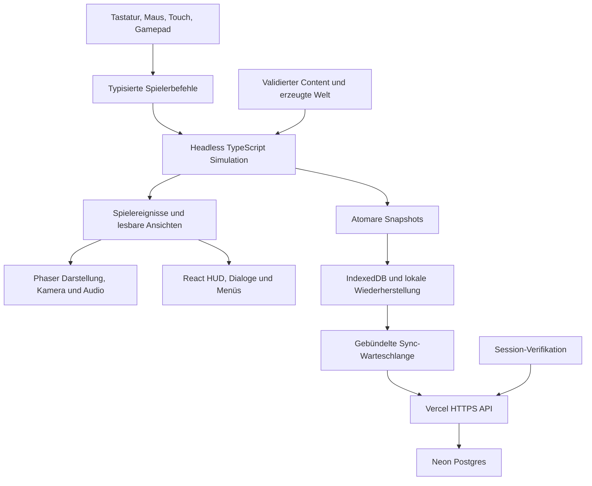

> Umsetzungshinweis vom 02.10.2026: Dieser Plan beschreibt die ursprünglichen Produktionsziele. Der verifizierte Implementierungsstand und bewusste Abweichungen stehen in docs/IMPLEMENTATION.md. Die Anmeldung wurde auf Nutzerwunsch auf Benutzername und Passwort umgestellt.

# Dungeon Crawler – vollständiger Umsetzungs- und Produktionsplan

**Planungsversion:** 1.1 · **Recherche:** 2. Oktober 2026 · **Arbeitstitel:** BELOW THE BROADCAST / UNTER DER SENDUNG

**Eingearbeitete Erweiterung:** benannte Zwischenbosse, seltene Begegnungen, größeres Bestiarium und deutlich größerer Itempool nach dem ergänzenden Nutzerwunsch.

**Zielrepository:** [bthginfo/Dungeon-Crawler](https://github.com/bthginfo/Dungeon-Crawler). GitHub und der lokale Arbeitsordner sind zum Recherchezeitpunkt leer. Lokal existiert ein Git-Repository ohne Commit und ohne Remote. Dieses Dokument ist die Planungsgrundlage; Spielcode, Assets, Cloudressourcen und Deployments wurden noch nicht erstellt.

## 0. Verbindliche Ausgangsentscheidungen

Empfohlen wird ein eigenständiger **2D-Action-Dungeon-Crawler in schräger Draufsicht**, mit Roguelite-Expeditionen, einer vollständig abschließbaren Storykampagne und einer KI-Begleitfigur. Ziel sind Browser auf Desktop, Tablet und Smartphone. Gastspiel funktioniert ohne Anmeldung; Cloudspielstände ergänzen den lokalen Speicher. Deutsch und Englisch sind gleichwertige Release-Sprachen.

Die im Chat gestellten optionalen Fragen zu Perspektive und Einzelspieler/Koop sind noch unbeantwortet. Dieser Plan verwendet die empfohlenen Annahmen: schräge 2D-Draufsicht und Einzelspieler. Eine andere Antwort verändert insbesondere Engine, Animationen, Eingaben und bei Online-Koop das Hostingmodell. Echtzeit-Koop wäre ein eigener Architektur- und Betriebsumfang und passt nicht als zusätzliche Funktion in diesen kostenlosen Vercel-Plan.

„32-bit-Grafik“ bedeutet hier die **ästhetische Qualität der 32-Bit-Ära**: detailreiche Pixel-Art, gute Animationen, atmosphärische Räume, ausdrucksstarke Figuren und durchgestaltete Oberflächen. Es ist keine technische Vorgabe für die Prozessorarchitektur oder eine bloße Vergrößerung von 16×16-Icons. Geplant sind überwiegend 32×32-Umgebungskacheln, größere Figuren und eigene Bossanimationen.

Das fertige Spiel erhält einen definierten, endlichen Umfang. „Vollständig“ bedeutet: alle zwölf zugesagten Floors, alle Kampagnenwege, alle Klassen, die vollständigen Oberflächen, beide Sprachen und alle Abnahmekriterien dieses Plans sind erfüllt. Ein technischer Prototyp, ein einzelner schöner Floor oder ein Vertical Slice erfüllt das Releaseziel nicht.

Die Zahlen unten sind eine konkrete Produktionsbaseline. Nach dem Vertical Slice werden Aufwand und Termine anhand gemessener Produktionszeiten neu berechnet. Eine Umfangsänderung muss ausdrücklich dokumentiert werden; fehlender Inhalt wird nicht durch Farbvarianten, leere Menüs oder „Coming soon“ ersetzt.

**Infrastruktur:** Vercel für statische Auslieferung und kleine HTTPS-Funktionen; Neon Free für relationale Daten und Cloudspielstände. Blob ist Objektspeicher, keine relationale Datenbank. Es wird für Version 1 nicht als Pflichtdienst benötigt. Alle Spielsysteme laufen lokal im Browser.

**Zugangsdaten:** Der im Chat offengelegte Deployment-Token wird weder hier gespeichert noch in Code, Beispiele, Logs oder Commits übernommen. Vor Deployment wird er widerrufen und durch einen neu ausgestellten, passend begrenzten Token oder eine sichere Vercel-Anmeldung ersetzt.

## 1. Produktidee und Qualitätsmaßstab

### 1.1 Eigenständige Identität

Die Welt wird von einem Senderkonsortium kontrolliert, das menschliche Erinnerungen in ein gigantisches Untergrundstudio überträgt. Die Teilnehmer halten den Dungeon zunächst für eine grausame Unterhaltungsshow. Tatsächlich dienen Zuschauerreaktionen und Kampfentscheidungen dazu, Persönlichkeiten zu vermessen, Erinnerungen zu lizenzieren und wiederkehrende Teilnehmerkopien zu produzieren.

Die Hauptfigur ist eine frei benannte ehemalige Wartungskraft. Ihr Wissen über Anlagen, Leitungen und unvollkommene Technik liefert eine glaubwürdige Grundlage für improvisierte Waffen und Systemmanipulation. NIX, ein mechanischer Schakal mit beschädigtem Archivmodul, begleitet sie. Gemeinsam suchen sie keinen größeren Gewinn, sondern einen Weg, die gespeicherten Teilnehmer zu befreien.

Die Inspiration aus Dungeon Crawler Carl wird über schwarzen Humor, absurd inszenierte Gefahren, Sponsorendruck und den Konflikt zwischen Show und Menschlichkeit aufgenommen. Namen, Figuren, konkrete Szenen, Dialoge, Logos und Buchgrafiken entstehen eigenständig. Der Arbeitstitel wird vor öffentlicher Veröffentlichung geprüft und bei Bedarf geändert.

### 1.2 Fünf Designpfeiler

1. **Lesbarer, präziser Kampf:** klare Gegnerabsichten, zuverlässiges Ausweichen, nachvollziehbarer Schaden und gute Bedienung mit allen Eingabegeräten.
2. **Bedeutungsvolle Builds:** Klassen, Fähigkeiten und Loot eröffnen unterschiedliche Entscheidungen; reine Zahlensteigerung ersetzt keine Spieltiefe.
3. **Gestaltete Welt mit Variation:** inszenierte Storyräume und Bossarenen werden mit geprüften prozeduralen Raumkombinationen verbunden.
4. **Eine fortlaufende Geschichte:** Entscheidungen, Beziehungen und Enthüllungen greifen ineinander. Tod hat Regeln und erzeugt keine widersprüchliche Welt.
5. **Fertige Präsentation:** einheitliche Grafik, Sound, Texte, UX und funktionierende Fehlerzustände gehören zur Definition einer fertigen Funktion.

### 1.3 Nutzungsmodell

- Kostenloses persönliches Browserprojekt ohne Werbung, Shop, Echtgeldwährungen oder kostenpflichtige Laufzeit-KI.
- Neue Sitzung: Sprache wählen → neues Spiel oder fortsetzen → wenige verständliche Charakterentscheidungen → direkt in den spielbaren Einstieg.
- Keine Anmeldung vor dem ersten Kampf. Optionale Anmeldung mit Benutzername und Passwort aktiviert Cloud-Sync.
- Sessionlänge frei: jederzeit lokal pausieren und fortsetzen; Expeditionen dauern als Ziel 35–65 Minuten.
- Vier Akte mit je drei Floors. Ein konzentrierter erfolgreicher Kampagnenweg dauert ungefähr 3–5 Stunden; Erstabschluss mit Erkundung, Nebenquests und Fehlversuchen als Ziel 12–20 Stunden. Das sind zu validierende Designziele.
- Story, Standard und Herausforderung als Schwierigkeitsprofile. Die Storyversion enthält den gesamten Inhalt und dieselben Abschlussmöglichkeiten.
- Ein abschließbares Endgame: wiederholbare Expeditionen, freischaltbare Modifikatoren und New Game Plus mit klarer Progressionsgrenze.

## 2. Umfang der vollständigen Version 1.0

| Bereich | Produktionsbaseline | Fertig bedeutet |
| --- | --- | --- |
| Kampagne | 4 Akte, 12 Floors, 3 Schlussentscheidungen mit variablen Epilogen | Von Einstieg bis Credits spielbar; jeder Schluss besitzt Folgen und einen spielbaren Nachzustand |
| Hub | 1 zentraler Hub, 4 sichtbare Ausbauphasen | Funktionsfähige Händler, Werkstatt, Archiv, Beziehungen und Expeditionszugang |
| Klassen | 6 Klassen, je 2 Spezialisierungen | Alle Klassen bestehen alle Pflichtmechaniken |
| Fähigkeiten | Je 4 reguläre Fähigkeiten und 1 Ultimate, insgesamt 30 | Auswahl, Animation, Trefferwirkung, Kosten, Erklärung und Eingaben sind vollständig |
| Talente | Je 10 Talente, insgesamt 60 | Mindestens 2 tragfähige Builds pro Klasse; Spezialisierungen verändern Entscheidungen |
| Gegner | 96 Grundtypen, je 8 pro Floor | Eigene Rolle, lesbare Silhouette und Verhalten; Recolors zählen nicht als neue Typen |
| Eliten | 24 Varianten mit zusätzlichen Mechaniken | Je Floor zwei getestete Eliten; unterscheidbare Angriffsmodifikation |
| Zwischenbosse | 24 benannte Begegnungen, je 2 pro Floor | Eine garantierte und eine optionale Begegnung pro Floorlayout; eigene Mechanik, Arena, Reward und Codex |
| Bosse | 12 eigene Hauptbosse | Mehrere Angriffsmuster, Phasenwechsel, Inszenierung, Loot, Codex und Sieg-/Niederlagenzustand |
| Räume | 28 kuratierte Vorlagen pro Floor, insgesamt 336 | Kollision, Navigation, Anschlüsse, Spawns, Licht, Interaktionen und Dekoration geprüft |
| Begegnungen | 20 Formationen pro Floor, insgesamt 240 | Kombination, Reihenfolge, Budget und Gegenmaßnahmen definiert |
| Quests | 36 Haupt-, 48 Neben-, 18 Beziehungsquests; insgesamt 102 | Start, Voraussetzungen, Ziele, Zustände, Belohnung, Folgen, Wiederholung und beide Sprachen |
| Storyereignisse | 2 pro Floor, insgesamt 24 | Skript, Teilnehmer, Auslöser, Abbruchregeln und Wiederholungsdialog |
| Prozedurale Ziele | 48 geprüfte Challenge-Vorlagen | Werden getrennt von den 102 geschriebenen Quests gezählt |
| Ausrüstung | 360 Basisdefinitionen über 8 Slots | Darunter 72 benannte Uniques und 48 Setitems; jedes Item hat Icon, Daten, Beschreibung und Quelle |
| Weitere Gegenstände | 120 Relikte, 72 Verbrauchsgegenstände, 24 Quest-/Story-Schlüssel | Keine Platzhalterwirkungen; Schlüssel können Hauptfortschritt nicht dauerhaft blockieren |
| Affixe | 160 kompatibilitätsgeprüfte Effekte | Gewichtung, Ausschlüsse, Stacking, Erklärung und Auswirkung auf Tooltip |
| Crafting | 36 gezielte Rezepte | Erwerb, Materialbedarf, Ergebnis und Bedienung vollständig |
| Wichtige Figuren | 10 NPCs plus Spielerfigur | Eigene Rollen, Portraits, Dialoge und kampagnenabhängige Zustände |
| Oberfläche | Gesamte Liste in Abschnitt 10 | Desktop, Touch, Tastatur und Gamepad; alle Lade-, Fehler- und Speicherzustände |
| Sprachen | DE und EN, vollständig | Keine sichtbaren Schlüssel, gemischten Sprachzustände oder unübersetzten Storyzweige |
| Speicher | 3 Kampagnenslots, lokal und optional Cloud | Fortsetzen, Export/Import, Migration, Konflikte und Wiederherstellung |
| Audio | Floor-Ambiences, Exploration/Kampf, Boss-/Aktmotive, UI und SFX | Kein stiller späterer Floor; Wiederverwendung nur als bewusstes Arrangement |

Gezählt werden verwendbare Inhalte mit Produktionsstatus und Abnahmebeleg. Ein Affix ersetzt kein Basisitem; eine Zufallsaufgabe ersetzt keine geschriebene Nebenquest. Alternative Phasen desselben Bosses zählen als ein Boss.

## 3. Spielablauf, Bewegung und Kampf

### 3.1 Schleifen

**Moment:** lesen → positionieren → angreifen oder Fähigkeit einsetzen → Gefahren ausweichen → Gegnerreaktion bewerten.

**Raum:** Umgebung und Ausgänge lesen → Begegnung oder Rätsel lösen → Loot/Entscheidung → sicherer Übergang.

**Floor:** Hauptziel verfolgen → optionale Wege und Quests wählen → Ressourcen abwägen → Boss/Schaltpunkt → Schleuse.

**Expedition:** Klasse, Spezialisierung und Startpaket wählen → drei Floors meistern → Ausrüstung situativ umbauen → am Aktende extrahieren → Hub und kanonischen Fortschritt aktualisieren.

**Kampagne:** vier Akte freischalten → Senderstruktur verstehen → Beziehungen und Fraktionen entwickeln → Systemschlüssel zusammensetzen → Schlussentscheidung treffen → Epilog/Endgame.

### 3.2 Kampfregeln

- Kontinuierliche Bewegung auf XY; dekorative Höhe beeinflusst Tiefensortierung, nicht versteckt die Trefferlogik.
- Grundangriff, zwei ausgerüstete reguläre Fähigkeiten, Ultimate, Ausweichen und ein ausgewählter Verbrauchsgegenstand.
- Fähigkeiten werden aus vier Klassenfähigkeiten gewählt. Wechsel und vollständige Respecs sind im Hub kostenlos.
- Nahkampf nutzt echte Reichweite, Winkel und Hindernisse. Fernkampf prüft Sichtlinie und Projektilbewegung.
- Ausweichen hat Kosten, kurze definierte Unverwundbarkeit und klar markiertes Ende. Keine Animation verschiebt unbemerkt die Trefferfenster.
- Kleine Eingabepuffer machen Aktionen bei knappen Übergängen zuverlässig. Block und Dodge besitzen explizite Prioritätsregeln.
- Standard-Gegner kündigen große Angriffe an; erstmalig eingeführte Bossangriffe erhalten großzügigere Vorwarnungen.
- Erste Tuningwerte: ungefähr 400–800 ms Vorwarnung für starke Standardangriffe, 700–1.200 ms für neue Bossflächen, 100–150 ms Eingabepuffer. Das Balancing wird auf echten Touchgeräten gemessen.
- Hazard-Ausbreitung, Schockketten und Explosionen dürfen nicht ohne lesbaren Auslöser sofort außerhalb des Bildes töten.
- Trefferfeedback: Pose, klarer Effekt, kurzer Sound und optional dezenter Hitstop. Screen Shake und Flashes sind abschaltbar.
- Pausieren öffnet Inventar, Dialog, Journal und Einstellungen ohne Echtzeitdruck. Showtimer messen Simulationszeit.
- Bossarenen besitzen keine notwendige Pixelgenauigkeit bei Touch. Laufwege, Interaktionspunkte und Angriffsfenster werden darauf ausgelegt.

### 3.3 Status- und Interaktionssystem

Acht Kernzustände: Brennen, Frost, Schock, Korrosion, Blutung, Taumeln, Schutz und Entblößung. Zusätzlich existieren Umweltmerkmale wie Nässe, Öl und Leitfähigkeit.

Jeder Status definiert Dauer in Ticks, Stapelgrenze, Erneuerung, Resistenz, Darstellung und Schadensquelle. Schaden über Zeit kann keinen zufälligen oder mehrfachen Kill-/Questabschluss auslösen. Stun-Ketten werden begrenzt; Bosse haben sichtbare Widerstandsfenster.

Beispiele für geprüfte Synergien: Feuer entzündet Ölflächen; Schock breitet sich begrenzt über nasse Ziele aus; Frost stoppt zeitweise gefährliche Bodenströme; Korrosion schwächt Panzerteile statt sämtliche Bosse zu ignorieren. Das gleiche System ist für Spieler, Gegner und Umgebung verbindlich.

### 3.4 KI

Gegnerrollen: Verfolger, Flankierer, Schütze, Beschwörer, Tank, Supporter, Flächenkontrolle und Hinterhalt. Endliche Zustandsautomaten mit datengetriebenen Parametern genügen; ein umfangreiches generisches Behavior-Tree-Framework wird nicht vorab gebaut.

Jede KI besitzt Wahrnehmung, Zielwahl, Navigation, Vorbereitungsphase, Angriff, Erholung, Unterbrechung und Rückkehrverhalten. Raumgrenzen, Türen und Schutzbereiche sind explizit. Ein Encounter Director platziert passende Gruppen anhand eines Raumbudgets; er verändert Gegnerzahlen nicht heimlich aufgrund der Spielerstärke.

NIX folgt, meidet markierte Gefahren, unterstützt das priorisierte Ziel und besitzt einen einfach verständlichen Hilfsbefehl. Er blockiert keine Türen und löst keine Hauptquest allein aus. Außerhalb des Bildes ist sichere Wiedervereinigung erlaubt. Seine Navigation darf keine Pflichtmechanik blockieren.

## 4. Klassen, Fähigkeiten und Builds

Die Klasse ist eine taktische Ausrichtung, keine gesperrte Ausrüstungsfamilie. Alle können Pflichtschalter bedienen, Schlüssel tragen, Gegner erreichen und Kampagnenrätsel lösen.

| Klasse DE / EN | Rolle und Ressource | Vier reguläre Fähigkeiten | Ultimate | Spezialisierungen und Buildidee |
| --- | --- | --- | --- | --- |
| Brecher / Breaker | Nahkampf, Schutz und Druck; Ausdauer | Rammschlag, Schrottschild, Bodenbruch, Provokation | Abrisskommando | Bollwerk: Konter und Schutz; Randalierer: Taumeln und Flächenschaden |
| Funkenweber / Sparkweaver | Elementare Flächenkontrolle; Fokus | Lichtbogen, Frostanker, Brandknoten, Energietausch | Netzüberlastung | Leiter: Kettenreaktionen; Wärmesenke: Kontrolle und Ressourcenerholung |
| Schattengänger / Shade Runner | Mobilität, Markierungen und kritische Fenster; Ausdauer | Rückenstich, Nebeltritt, Fadenschnitt, Köderbild | Schwarzer Schnitt | Duellant: präzise Einzelziele; Saboteur: Fallen und sichere Positionswechsel |
| Schrottmeister / Scrapper | Geräte, Fallen und Improvisation; Schrottladung | Minenkranz, Geschützturm, Magnetzug, Reparaturpuls | Schrottsturm | Konstrukteur: verlässliche Geräte; Plünderer: Umbau und kurzlebige Explosionsketten |
| Vertragshüter / Pact Warden | Schutz, Flüche und kostenbewusste Verstärkung; Bindung | Schutzsiegel, Schuldenmal, Lebenspfand, Bannkreis | Vertragsbruch | Hüter: Barrieren und Support; Vollstrecker: Flüche gegen bewusstes Risiko |
| Spurenjäger / Trail Hunter | Reichweite, Zielpriorität und NIX-Synergien; Fokus | Präzisionssalve, Fangdraht, Spürmarke, Rückzugsfeuer | Jagdprotokoll | Scharfschütze: Sichtlinie und Schwachstellen; Fährtenleger: Fallen und Begleiterkombinationen |

Je Klasse werden eine Signaturpassive und zehn Talentdefinitionen ausgearbeitet; diese sind Bestandteil der Klassenkonfiguration. Zwei Spezialisierungen ändern zentrale Regeln, etwa Block → Konter oder Turm → bewegliches Gerät, statt lediglich +5 % Schaden zu geben.

Der Build-Abnahmevertrag fordert mindestens zwei vollständige Loadouts pro Klasse: Fähigkeiten, Talentpfad, Startausrüstung, zwei passende Relikte, verfügbare Gegenmaßnahmen und eine belegte Bossstrategie. Dazu kommt je ein absichtlich gemischter Build, der das Spiel nicht durch inkompatible Affixe blockiert.

Balance berücksichtigt Eingabegeräte: manuelles Zielen auf Desktop und einstellbare Zielhilfe auf Touch sollen dieselben Taktiken ermöglichen. Automatische Zielwahl wird erklärt, ist abschaltbar und respektiert markierte Ziele.

## 5. Progression, Tod und dauerhafte Zustände

### 5.1 Drei Zustandsbereiche

1. **Profil:** Optionen, Freischaltungen, Codex und Erfolge.
2. **Kanonische Kampagne:** bestätigte Storyentscheidungen, Beziehungen, Fraktionen, Schlüssel und Aktzugänge.
3. **Expedition:** aktuelle Instanz, Karte, temporäres Level, Laufwährung, nicht extrahierte Beute und noch unbestätigte Ereignisse.

Kampagne und Expedition werden in einem atomar gespeicherten Kampagnendokument zusammengeführt. Ein HUD-Status und die Schleusensequenz zeigen, wann ein Storyfortschritt bestätigt wurde.

### 5.2 Checkpoints und Wiederholungen

- Der Hub ist ein sicherer kanonischer Ort. Nach jedem Floor existiert außerdem eine sichere Schleuse, die Storyfortschritt bestätigt.
- Dauerhafte Aktzugänge werden erst am Ende des dritten Floors eines Aktes freigeschaltet.
- Bestätigte Storyentscheidungen werden durch einen Tod niemals rückgängig gemacht.
- Bei einem Fehlversuch beginnt die Expedition wieder am Eingang des aktuell gewählten Aktes; bereits bestätigte Quests werden nicht erneut mit identischer Erstinszenierung erzählt.
- Erledigte Storyräume erhalten definierte Wiederholungszustände: kürzere Durchquerung, Archivnachhall, alternative Begegnung oder optionale Challenge. Keine Kopie eines einmal geretteten NPCs steht wieder als ungeretteter Hauptquest-NPC im Weg.
- Innerhalb eines Floors bleiben Ereignisse bis zur Schleuse vorläufig. Nicht bestätigte Entscheidungen werden im Journal als Expeditionsereignisse markiert.
- Story-Schlüssel und Pflichtbeweise werden bei Bestätigung in die Kampagne überführt. Pflichtgegenstände können nicht verkauft, zerstört oder versehentlich verbraucht werden.
- Tod verwirft temporäre Level, Laufgeld und ungesicherte Beute nach klaren Regeln; Codex, bestätigte Quests und Aktzugänge bleiben.
- Die Rekonstruktion im Hub erklärt die Rückkehr der Spielfigur. Andere NPCs behalten ihre bestätigte Geschichte; der Tod des Spielers rewound nicht die ganze Welt.

### 5.3 Level und Meta

Expeditionslevel reichen von 1 bis 20. Akt-Baselines sind 1, 6, 11 und 16; die Akt-Caps 5, 10, 15 und 20. Neue Versuche starten mit der jeweiligen Akt-Baseline und einem passenden Starterset. So beginnt Floor 10 nicht mit einem ungeeigneten Level-1-Charakter.

Eine permanente Meisterschaft von 1 bis 15 schaltet Optionen frei: alternative Startersets, Talentangebote, Rezepte, kosmetische Anpassungen und Informationshilfen. Sie erzeugt keine unbegrenzte Schadensskalierung. Eine frisch freigeschaltete Klasse muss den aktuellen Akt mit dem bereitgestellten Starterset bewältigen können.

XP-Kurven, Schadenswerte, Preise, Resistenz- und Abklingzeitgrenzen sind Inhaltsdaten. Ein Balancing-Simulator misst Zeit bis zum Kill, eingehenden Schaden, Erholungszeiten und Ressourcenbedarf. Feste Wellen, erwartete Item-Power und Eingabeprofile sind Teil der Vergleichsfälle.

New Game Plus erstellt einen neuen Kampagnendurchlauf mit übernommenen zulässigen Freischaltungen. Der alte Abschluss bleibt erhalten. Die Herausforderung skaliert über begrenzte Modifikatoren und neue Encounter-Kombinationen; keine endlos anwachsende Item-Power.

## 6. Loot, Ausrüstung, Wirtschaft und Crafting

### 6.1 Ausrüstung und Inventar

Acht Slots: Hauptwaffe, Nebenhand, Kopf, Körper, Hände, Füße, Amulett und Talisman. Zwei getrennte Reliktplätze verändern Buildregeln. Der Rucksack besitzt 24 Plätze mit sinnvollen Stacks für Verbrauchsgüter; ein Hub-Lager besitzt Filter und Sortierung.

360 Basisdefinitionen entsprechen 45 je Slot. Darunter sind 72 benannte Uniques mit gezielter Wirkung sowie 48 Setitems in zwölf vierteiligen Sets; diese beiden Gruppen überschneiden sich nicht und sind in den 360 bereits enthalten. 120 Relikte ergänzen Builds. 72 Verbrauchsgüter und 24 Quest-/Story-Schlüssel ergeben insgesamt **576 Gegenstandsdefinitionen**; die 160 Affixe werden separat gezählt.

Die 72 Uniques verteilen sich auf zwölf Hauptbossbelohnungen, 24 Zwischenbossbelohnungen, 24 seltene Quest-/Entdeckungsbelohnungen und zwölf besondere Crafting-Ergebnisse. Es gibt keine zusätzlichen versteckten Pflichtitems, um die Zählung zu erhöhen.

Zwölf Sets besitzen jeweils einen Zwei- und Vier-Teileffekt. Ihre vier konkreten Stücke werden festen Slots zugewiesen. Ein Zwei-Teileffekt ermöglicht gemischte Builds; der Vier-Teileffekt verändert eine Regel und bringt eine erkennbare Einschränkung. Sets sind keine zwingende Voraussetzung für den Abschluss.

Die 120 Relikte werden in sechs Familien à 20 gegliedert: Elemente, Geräte, Sponsoren, Verträge/Flüche, NIX-Kombinationen und Mobilität. 72 Verbrauchsgüter umfassen 24 taktische Wurfmittel sowie je zwölf Erholungs-, Werkzeug-, kurzfristige Verstärkungs- und Erkundungshilfen. Die 24 Schlüssel enthalten zwölf Hauptstory- und zwölf optionale Questdefinitionen.

Sechs Seltenheiten: gewöhnlich, ungewöhnlich, selten, episch, legendär und singulär. Seltenheit wird durch Farbe, Form/Rahmen und Text erkennbar. Questgegenstände verwenden eine eigene Kennzeichnung, keine höhere Seltenheit.

Jedes Item definiert stabile ID, Typ, Slot, erforderlichen Akt, Basiseffekt, Affixgruppen, Wertebereiche, Icon, DE-/EN-Texte, Verkauf/Salvage und Herkunft. Beschreibungen erklären Wirkungen in normaler Sprache; ein Detailmodus zeigt Berechnung und Grenzen.

### 6.2 Dropregeln

- Welt, Beute und Kampf haben getrennte Zufallsströme. Dekorationsänderungen verändern keine Dropfolge.
- Loot ist floor- und aktgebunden gewichtet; Klassenbias hilft, sperrt aber andere Builds nicht aus.
- Wichtige Waffenrollen und Heilungsmöglichkeiten sind erreichbar; kein Seed verlangt ein extrem seltenes Item.
- Bosse geben einen klaren Abschlussreward und mindestens eine nützliche Auswahl.
- Duplicate-Schutz und Pity-Regeln betreffen einzelne seltene Belohnungskategorien und sind dokumentiert.
- Affix-Kompatibilität verhindert unmögliche Ergebnisse wie Nahkampf-Lebensentzug auf einer reinen Dekorationshand.
- Stacking, Reihenfolge und Rundung sind zentral definiert. Rekursive On-Hit-Ketten erhalten harte Grenzen.
- Keine Echtgeld-Lootboxen. Zuschauerpakete sind rein spielinterne, nachvollziehbare Belohnungsereignisse.

### 6.3 Wirtschaft

Laufgeld kauft Heilung, situative Items und Services während einer Expedition. Archivmarken finanzieren horizontale Hub-Freischaltungen. Fraktionsruf ist ein eigener Kampagnenzustand und keine käufliche Universalwährung.

Händler haben ein kuratiertes Sortiment plus begrenzte Zufallsangebote. Preise sind progressionsgebunden. Respec ist kostenlos im Hub; Identifizieren, Reparatur und Inventarverwaltung dürfen nicht als lästige Pflichtarbeit dominieren.

Crafting konzentriert sich auf 36 nachvollziehbare Rezepte: zwölf Grundoptionen, zwölf Umbaurezepte und zwölf besondere Uniques. Keine unüberschaubare Crafting-Matrix. Vorschau zeigt Ergebnis, benötigte Materialien und Auswirkungen vor dem Bestätigen. Verkauf/Salvage ist für favorisierte und ausgerüstete Items geschützt.

### 6.4 Absurde Gegenstände mit nachvollziehbaren Regeln

Showbelohnungen haben eine prägnante Idee und eine konkrete Spielwirkung. Seltene Ausrüstung enthält Gegenleistung, Auslöser und Grenzen im Tooltip. Der Humor stammt aus Herkunft und Funktionsweise, ohne die Lesbarkeit eines Kampfeffekts zu zerstören.

| Beispielgegenstand | Wirkung und Buildnutzen | Eingebaute Grenze |
| --- | --- | --- |
| Notausgang auf Rollen | Dodge hinterlässt kurz einen nutzbaren Deckungskörper | Nur ein Körper aktiv, er blockiert keine Pflichtwege |
| Mikrofon des Widerspruchs | Unterbrochener Gegner erzeugt einen kleinen Stille-/Taumelimpuls | Interner Cooldown; immunisierte Bosse bleiben nachvollziehbar |
| Einweg-Kronzeuge | Ein tödlich treffender Angriff wird einmal je Expedition in einen stark begrenzten Restzustand umgewandelt | Danach verbraucht; keine Rekursionskette mit Wiederbelebung |
| Rabatt auf den Untergang | Ein bewusst gewählter höherer Gefahrengrad verbessert eine begrenzte Rewardauswahl | Risiko vorher sichtbar; Hauptfortschritt bleibt ohne Vertrag möglich |
| Quittung für geliehene Wut | Block sammelt eine gedeckelte Ladung für den nächsten Grundangriff | Ladung verfällt; Offscreen-Farmen liefert keinen unendlichen Schaden |
| Zimmerpflanze mit Sicherheitsfreigabe | Eine gesetzte Pflanze schützt einen kleinen ruhigen Bereich und zieht begrenzte Aggro | Ein Gerät aktiv; Bossarena und Türregeln bleiben gültig |
| Wartungshandbuch, Band Null | Korrosionsmarkierung öffnet kurz einen zusätzlichen Geräteschwachpunkt | Keine dauerhafte Reduktion aller Resistenzen |
| Garantierte Fehlfunktion | Geräte explodieren beim kontrollierten Abbau und erstatten einen Teil der Ressource | Eigene Explosion startet keine weitere Abbaukette |
| NIX' zweiter Gedanke | Begleiterhilfe hinterlässt einen wiederholbaren, schwächeren Folgeeffekt | Ein Echo pro Befehl; sichtbares Ladefenster |
| Versicherung gegen Kleingedrucktes | Ein einzelner negativer Vertragseffekt kann je Floor vorher angekündigt abgefangen werden | Kein Umgehen von Schlussentscheidungen oder Storykosten |
| Archiv der verpassten Chancen | Nach einer abgelehnten Lootauswahl wird die nächste Auswahl aus einer kleinen anderen Kategorie ergänzt | Begrenzte Kategoriewechsel, kein beliebiges Duplizieren |
| Der letzte saubere Löffel | Erholung entfernt einen gewählten Status und bereitet einen Konter vor | Eine Auswahl, keine gleichzeitige Vollheilung und Komplettreinigung |

Solche Regeln werden als deklarative, begrenzte Effekte implementiert. Der Contentvalidator prüft Triggerzyklen, Rekursionsgrenzen, inkompatible Slots und Grenzen von On-Hit-, On-Kill- und Geräteketten. Seltene „verdrehte“ Gegenstände erhalten eine verständliche Erklärung und eine sichere Gegenstrategie.

## 7. Welt, Figuren und Erzählstruktur

### 7.1 Fraktionen

- **Konsortium:** produziert die Sendung und verwaltet Erinnerungsrechte; kein monolithischer Gegner, interne Machtkämpfe.
- **Freie Frequenz:** Widerstandsnetz aus Wartungskräften, Teilnehmern und Archivaren; will die Kontrolle aufbrechen.
- **Gilden der Tiefe:** Händler und Handwerker; entscheiden zwischen Stabilität und persönlicher Freiheit.
- **Echo-Kollektiv:** unvollständig rekonstruierte Teilnehmer; fordert ein Recht auf Erinnerung statt bloß auf Weiterexistenz.

Ruf beeinflusst Dialoge, Preise, optionale Wege und Epiloge. Eine schlechte Beziehung schließt die Hauptkampagne nicht aus. Für jede notwendige Information gibt es einen Hauptquestweg oder einen dokumentierten Ersatz.

### 7.2 Hauptfiguren

| Figur | Funktion | Konflikt und Entwicklung | Visuelles Briefing |
| --- | --- | --- | --- |
| NIX | Mechanischer Schakal, Feldbegleiter | Enthält einen fragmentierten Zugangsplan; muss zwischen Auftrag und selbst gewählter Bindung unterscheiden | Kompakter Metallkörper, asymmetrische Ohrantennen, warme Archivleuchte |
| Mira Voss | Sanitäterin und Hub-Anker | Hat Teilnehmerkopien repariert und dabei Herkunftsdaten verdrängt; lernt Verantwortung ohne falsche Erlösungsversprechen | Arbeitsmantel, Reparatur-/Medizinwerkzeuge, klare ruhige Silhouette |
| Ilya Kern | Archivtechniker | Will Beweise sichern, riskiert dabei die Identität anderer | Dunkler Overall, optische Leselinse, tragbarer Datenrahmen |
| Tam Orun | Schrotthändler | Profitiert vom System und bezahlt früheren Widerstand mit familiären Schulden | Breite Werkstattsilhouette, Markierungsstempel, modularer Rucksack |
| Zuv | Organischer Techniker | Seine Gilde hält die tieferen Anlagen am Leben; ein Aufstand gefährdet auch Bewohner | Pilz-/Mineraltexturen, Werkzeugarme, sanfte Farbflächen |
| Enno Vale | Ehemaliger Teilnehmer | Seine Erinnerungen wurden mehrfach kuratiert; er sucht eine verlässliche eigene Geschichte | Abgenutzte Showkleidung, sichtbare alte Sponsorpatches |
| SERA | Moderations-KI | Kommentiert zunächst zynisch, entdeckt später die Widersprüche ihres Auftrags | Eigenes geometrisches Emblem, wechselnde Bildschirmgesichter, keine Franchise-Anmutung |
| Direktor Veyl | Produktionsleiter | Nutzt Stabilität als Rechtfertigung für Ausbeutung | Eleganter Anzug, kaltes Leitsystem, kontrollierte Bewegungen |
| Rhea Sol | Gefeierte Gewinnerin | Ihre Befreiung ist Sponsorpropaganda; kann Gegnerin, Zeugin oder Verbündete werden | Glänzende Siegerausrüstung mit beschädigter Rückseite |
| Oris | Vertragsprüfer | Erkennt den Rechtsbruch des eigenen Konsortiums, fürchtet einen vollständigen Systemverlust | Schwebende Aktensegmente, Maskenvisier, neutrale Signalfarbe |

Die Spielerfigur erhält mehrere Haut-/Haaroptionen und farblich anpassbare Ausrüstung. Zwei konsistente animierte Körperbasen plus Klassenaufsätze sind eine realistische Produktionsbasis; jede Zusatzvariante muss den vollständigen Animationssatz besitzen.

### 7.3 Vier Akte

**Akt I – Teilnahmebedingungen, Floors 1–3:** lernen, handeln, überleben. Die Figur findet NIX und entdeckt, dass verlorene Teilnehmer nicht einfach tot sind, sondern als vermarktbare Erinnerungsbestandteile weitergeführt werden. Die erste vollständige Beweiskette öffnet den Hub-Zugang zur Freien Frequenz.

**Akt II – Der Preis des Applauses, Floors 4–6:** mit lebenden Anlagen und gefährlichen Verträgen umgehen. Rhea zeigt, dass auch Gewinner dem Sender gehören. Die Sponsoren wählen emotionale Krisen gezielt aus. Ein gestohlener Wartungsschlüssel ermöglicht den Weg zu den Archiven.

**Akt III – Wem gehört eine Erinnerung?, Floors 7–9:** Originale, Kopien und bearbeitete Lebensgeschichten unterscheiden. Ennos Fall verbindet frühere Hinweise. SERA erkennt, dass das Konsortium ihre eigenen Entscheidungsprotokolle manipuliert. Der Aufstand benötigt ein Übertragungsnetz, das die Teilnehmer beim Systemwechsel schützt.

**Akt IV – Letzte Ausstrahlung, Floors 10–12:** Beweise übertragen, den Übergang stabilisieren und die Senderkontrolle erreichen. Veyl stellt Freiheit gegen behauptete Versorgungssicherheit. Die Schlussentscheidung verändert die Verwaltung der Teilnehmerarchive; sie wird nicht durch einen zufällig übersehenen Nebenquestgegenstand blockiert.

### 7.4 Enden und Kontinuität

Drei Schlussentscheidungen: **Befreien** (dezentraler Archivzugang), **Übernehmen** (verantwortliche aber riskante zentrale Kontrolle) und **Neu verhandeln** (ein überprüfbarer Vertrag mit SERA als begrenzter Verwalterin). Hauptquests machen alle drei erreichbar. Ruf, Beziehungsquests und Beweise verändern Erfolgskosten, Beteiligte und Epiloge.

Für jede Enthüllung existieren mindestens zwei frühere Hinweise. NIX' Zugangswissen erklärt seine Bedeutung ab Akt I, Rhéas Propaganda bereitet die Vertragsebene vor, Ennos Fall verbindet Rekonstruktion mit Erinnerungseigentum. Neue Regeln werden vor der relevanten Schlussentscheidung erklärt.

Die Weltbibel enthält Zeitlinie, Rekonstruktionsregeln, Senderhierarchie, Orte, Begriffe, Beziehungskarten, Wissensstände jeder Figur und Humorgrenzen. Tod, Wiederholung, Skip und unterschiedliche Quest-Reihenfolgen werden gegen diese Regeln geprüft.

## 8. Alle zwölf Floors

Jeder Floor besitzt eigene Materialpalette, Silhouetten, Props, Lichtstimmung, Geräuschkulisse, Traversalidee, acht Grundgegner, zwei Eliten, zwei Zwischenbosse, einen Hauptboss, drei Hauptquests und vier Nebenquests. Boss- und Zwischenbossräume sind handgebaut. Die erste Tabelle nennt vier Einstiegsgegner und die erste Elite je Floor; Abschnitt 8.1 vervollständigt das Bestiarium.

| Floor DE / EN | Weltgestaltung und Kernmechanik | Grundgegner; Elite | Boss mit Phasenidee | Erzählerische Funktion |
| --- | --- | --- | --- | --- |
| F01 Aufnahmehalle / Intake Hall | Verlassene Empfangsanlage, mintfarbene Anzeigen, Beton, Förderbänder; Bewegung, Schalter und Vorwarnungen | Kehrdrohne, Schlackenschleim, Kabelkriecher, Wachkonstrukt; Schichtführer | Pförtner-900: Scanlinien → verriegelte Tore → überlasteter Kern | NIX finden; der Eintrittsvertrag enthält einen ersten versteckten Archivverweis |
| F02 Rostkanäle / Rust Channels | Kupfer, schmutziges Wasser, Rohre und Notlichter; Ventile, Wasserstände und Leitfähigkeit | Rostratte, Sporenläufer, Ventilspucker, Kanalwache; Pumpenwart | Mutter Pumpe: Wasserströme → bewegliche Druckzonen → manuelle Ventilfenster | Mira retten; die Versorgung dient gleichzeitig der Teilnehmerkontrolle |
| F03 Schrottbasilika / Scrap Basilica | Schwarzes Metall, Amber, zusammengebaute Altäre; Magnetfelder und Deckung | Magnethund, Schrottschütze, Stapelgolem, Funkenvogel; Magnetdiakon | Der Sammler: angezogene Schrottwellen → Rüstungsteile → freigelegtes Archiv | Erste Beweise für verwertete Persönlichkeiten; Akt-I-Extraktion |
| F04 Pilzredaktion / Mycelium Newsroom | Organische Setwände, Biolumineszenz, Schreibmaschinen; Sporenkorridore und lebende Türen | Tintenling, Sporenwerfer, Wurzelfänger, Redaktionskäfer; Chefredakteur | Redaktor Myr: Text-/Sporenfelder → Wurzelkäfige → vergiftete Schlagzeilen | Die Show verändert Erinnerungen; Zuv eröffnet einen Versorgungskonflikt |
| F05 Glutgießerei / Ember Foundry | Basalt, Weißglut, bewegliche Gussformen; Hitzezonen, Kühlzyklen, Förderwege | Ofenimp, Gussläufer, Kettenschleuder, Kühlwächter; Vorarbeiter Glut | Vorarbeiterin Ash: Schmelzwellen → Abkühlung/Deckung → umgebauter Ofen | Teilnehmerkörper werden als austauschbare Produkte hergestellt |
| F06 Sponsorengalerie / Sponsor Gallery | Gold, Petrol, sterile Reklamesets; Verträge mit sichtbaren Kosten/Nutzen | Reklame-Drohne, Vertragsritter, Maskentänzer, Pfandvollstrecker; Markenchampion | Rhea, die Siegerin: Duell → Sponsorhilfen → freie Entscheidung nach Sieg | Der Gewinnervertrag widerlegt die versprochene Freiheit; Akt-II-Schlüssel |
| F07 Eisarchiv / Frozen Archive | Eisglas, Blau, versiegelte Erinnerungscontainer; rutschige Zonen, Licht-/Datenschlüssel | Frostschreiber, Archivmotte, Splittergeist, Indexwächter; Hauptregistrar | Der Bibliothekar: Suchstrahlen → verschobene Regale → gekühlter Gedächtniskern | Originale und bearbeitete Erinnerungen werden unterscheidbar |
| F08 Uhrwerkstadt / Clockwork Borough | Messing, Cyan, reparierte Wohnmodule; vorhersehbare Zeitzyklen und Gleise | Zeittick, Zahnradläufer, Pendelschütze, Reparaturspinne; Uhrmeister | Sekundant: angekündigte Zeitsprünge → Bahnwechsel → offener Synchronkern | Ennos frühere Durchläufe sind Bauteile eines Verhaltensmodells |
| F09 Spiegelarena / Mirror Arena | Obsidian, Magenta, falsche Showkameras; Spiegelbilder mit begrenzten eigenen Regeln | Echo-Klinge, Prismenschütze, Maskenweber, Reflexbestie; Doppelstar | Das Publikum: Zuschauergruppen → kopierte Angriffsfolgen → entlarvter Regiekern | SERA erkennt die Bearbeitung ihrer eigenen Protokolle; Akt-III-Netz |
| F10 Knochennetz / Bone Network | Elfenbein, Violett, Kabelstränge durch organische Träger; Knotenverbindungen und Rettungsrouten | Nervensucher, Knochenwächter, Pulswerfer, Kabelbrut; Netzchirurg | Wirbelsender: Knotenbarrieren → Leitungswellen → geschütztes Übertragungsfenster | Teilnehmerarchive müssen vor dem Kontrollwechsel stabilisiert werden |
| F11 Nullsignal / Null Signal | Verlassene dunkle Sendetechnik, vereinzeltes Cyan; Signalinseln, Orientierung und Sichtlinien | Ausfalldrohne, Nullgeist, Antennenjäger, Schweigewächter; Störkommissar | Stille: sichtbare Pulse → getrennte Signalinseln → wiederhergestelltes Echo | Die Beweise werden unabhängig übertragen; ein Ausfallplan macht Befreiung möglich |
| F12 Sendekern / Broadcast Core | Weiß, Schwarz, rotes Leitsystem, gigantische Regie; Kombination gelernter Mechaniken | Protokollritter, Kernsplitter, Regieschatten, Archivar-Konstrukt; Letzter Vollstrecker | Direktor Veyl: Regiekommandos → Sponsor-/Archivkopplung → Kontrollübergabe | Alle Konflikte münden in eine erklärte Schlussentscheidung mit Epilog |

Floor 11 reduziert die Audioinszenierung als Motiv, aber alle notwendigen Gefahrinformationen bleiben sichtbar. Die Spielbarkeit hängt niemals allein vom Ton ab.

Pro Floor werden zwei Storyereignisse geplant: ein Pflicht-Hinweis oder Konflikt und ein optionales Figuren-/Weltereignis. Die 24 Ereignisse erhalten eigene IDs und Bedingungen. Wiederholungsvarianten behandeln bereits bekannte Informationen sinnvoll.

### 8.1 Erweiterte normale Mobs und zweite Eliten

Die folgenden vier Grundtypen je Floor ergänzen die ersten vier aus der Floor-Tabelle auf insgesamt 96. Ein Typ zählt nur, wenn er in Rolle, Angriff, Erkennung oder Gegenmaßnahme eine relevante eigene Entscheidung verlangt.

| Floor | Vier zusätzliche normale Mobs | Zweite Elite |
| --- | --- | --- |
| F01 | Datenlaus: Schwarm-Flankierer; Sicherheitsläufer: angekündigter Sprint; Türwächter: Schildwinkel; Inkassospäher: markiert Ziele für Verbündete | Zutrittswächter: verschiebt sichere Torfenster |
| F02 | Saugwurm: Kanalhinterhalt; Druckqualle: leitender Impuls; Filterkrabbe: schützbare Panzerseite; Rinnenhexe: begrenzte Schleimbeschwörung | Druckmeister: kombiniert Ventilstoß mit Nahkampf |
| F03 | Kabelschlange: kurzer Positionszug; Rostmönch: begrenztes Schutzfeld; Presswerk: schwere geradlinige Charge; Altardrohne: kontrollierte Burstfenster | Schrottherold: baut eine unterbrechbare Magnetzone |
| F04 | Druckkobold: Papier-/Tintenfallen; Pilzschreiber: verzögerte Sporenminen; Klebemasse: langsam wandernde Zone; Wortsammler: stehlbare Fokusladung | Sporenkurator: verbindet zwei unterbrechbare Sporenanker |
| F05 | Schlackenkäfer: brennende Spur; Schmiedekonstrukt: offene/geschlossene Rüstung; Aschegeist: angekündigter Ortswechsel; Zunderträger: sichtbare Selbstexplosion | Härtungsmeister: wechselt kontrolliert Wärme-/Kühlzustand |
| F06 | Siegelträger: Schutzvertrag für Verbündete; Rabattjäger: riskanter Flankenangriff; Reklamefalter: sichtbares Lockbild; Vertragsgeist: unterbrechbarer Pfandstrahl | Vertragsscharfrichter: markiert ein klares Vertragsziel |
| F07 | Kältespinne: Eisnetze; Datenschatten: angekündigte Teleportposition; Siegelgolem: geschützter Frontbogen; Registerjäger: Linie durch Regalzwischenraum | Frostsiegelwart: verändert einen vorher markierten Archivkorridor |
| F08 | Federling: rhythmischer Sprung; Schienenkrabbe: Gleischarge; Messingvogt: Reparatur-Support; Minutenräuber: klar begrenzte Verlangsamungszone | Taktrichter: synchronisiert angekündigte Gegnerfenster |
| F09 | Glasläufer: zersplitternde Flanke; Linsenauge: schwenkender Strahl; Spiegelspinner: begrenzter Projektilreflektor; Kulissenfänger: verratender Hinterhalt | Prismenvogt: teilt ein angekündigtes Strahlmuster |
| F10 | Synapsenling: kurzer Knotenansturm; Rippenschütze: Deckungsprojektil; Transplantat: heilbarer, unterbrechbarer Support; Signalzecke: zeitlich begrenzte Ressourcenbindung | Pulsarchon: verbindet zwei sichtbare Leitungszonen |
| F11 | Flüsterläufer: sichtbare Spuren trotz Tarnung; Senderkrabbe: periodisches Signalband; Blinde Kamera: feste Suchkegel; Störschwarm: visuell markierte Zielhilfestörung | Sendeverweigerer: öffnet/schließt angekündigte sichere Signalinseln |
| F12 | Befehlsklinge: Kommandocharge; Übertragungswächter: veränderbarer Schutzbogen; Lizenzjäger: lösbare Bindung; Archivfalter: begrenztes Kernschutzfeld | Kernelhüter: kombiniert gelernte Protokolle ohne neue unlesbare Regeln |

Pro Floor werden 20 Encounter-Formationen aus diesen Rollen geschrieben. Ein Tank plus Support plus Flankierer fühlt sich anders an als acht gleiche Schützen. Raumform, Deckung, Hazard und Angriffstakt werden gemeinsam gestaltet.

### 8.2 Alle 24 Zwischenbosse

Je Floor existiert ein benannter Wächter auf dem Fortschrittsweg und ein freiwilliges Jagd-/Entdeckungsziel. Das optionale Ziel besitzt einen sichtbaren Hinweis und wird in seiner Chance nicht mit einer Pflichtquest verknüpft. Beim Layout ist seine Begegnung erreichbar; ob der Spieler sie aktiviert, entscheidet er selbst.

Zwischenbosse haben ungefähr zwei bis drei relevante Angriffsfolgen, einen Wendepunkt, kurze eigene Intro-/Outroinszenierung und eine individuelle Belohnung. Normale Kampfdauer als Tuningziel 60–120 Sekunden, Hauptbosse etwa 2–4 Minuten. Sie erhalten keine beliebig aufgeblähten Lebensbalken.

| Floor | Garantierter Zwischenboss: Mechanik | Optionaler Zwischenboss: Mechanik | Zwei individuelle Beuteideen |
| --- | --- | --- | --- |
| F01 | Qualitätsprüfer Q-17: Scanmarken zwischen sicheren Stempelfeldern | Kabelgreif: zieht sich an sichtbaren Ankern über den Raum | Zulassungsstempel; Geerdete Fangspule |
| F02 | Ventilzwillinge: gemeinsam angekündigte Druck-/Saugphasen; zählt als eine Begegnung | Der Fettfang: wächst durch kontrollierbare Abflussströme | Doppelventil-Amulett; Fettfangfilter |
| F03 | Kranheilige: Schrottlasten als Gefahr und spätere Deckung | Pfandschein-Golem: verliert gezielt zerstörbare Eigentumsplatten | Kransegen; Quittung für geliehene Wut |
| F04 | Richtigsteller: übermalt einzelne vorher markierte Bodenzonen | Sporenorakel: unterschiedliche Sporenfarben plus Formsignale haben klare Gegenmaßnahmen | Mikrofon des Widerspruchs; Kapsel des Orakels |
| F05 | Schlackenkönig: kühlbare Panzerflächen und sichere Ventilfenster | Die Nachtschicht: sichtbare Arbeitszyklen einer Maschinenkombination | Kalte Krone; Handschuhe der Nachtschicht |
| F06 | Inkasso-Engel: zeigt Pfandziel und kündigt den Preis vor dem Angriff an | Der Rabattgraf: bietet freiwillige, begrenzte Kampfrisiken an | Versicherung gegen Kleingedrucktes; Rabatt auf den Untergang |
| F07 | Index Null: sucht mit verständlich sortierten Suchstrahlen | Frostnotar: versiegelt Teilflächen, die kontrolliert aufgebrochen werden können | Band Null; Siegelbrecher |
| F08 | Der Fahrkartenrichter: fordert erkennbare Bewegungsrouten über Gleise | Rostpendel: pendelnde Angriffe mit verändertem, angekündigtem Takt | Notausgang auf Rollen; Pendelgewicht |
| F09 | Das Stand-In: übernimmt nur klar begrenzte zuvor beobachtete Angriffe | Splitterstar: bildet angreifbare und sichtbare falsche Spiegel | Maske des zweiten Auftritts; Prismenkern |
| F10 | Knotenarzt: repariert offen sichtbare und unterbrechbare Knoten | Archivverschlinger: nimmt temporäre Kopien auf, die im Kampf befreit werden | Einweg-Kronzeuge; Archiv der verpassten Chancen |
| F11 | Antennenfürst: schwenkt mehrere erkennbare Signalbänder | Der ungesendete Ruf: positionierbares Echo mit wiederholbarer Antwortphase | NIX' zweiter Gedanke; Restfrequenz-Talisman |
| F12 | Produktionsrat: drei kleine Teilinstanzen mit klarer Reihenfolge; zählt als ein Zwischenboss | Der letzte Statist: variierende Kombination gelernter Angriffsrollen | Letzte Freigabe; Der letzte saubere Löffel |

Die 24 Beuteideen werden den 24 Zwischenboss-Uniques zugeordnet, ohne die Itemzahl doppelt zu zählen. Der erste Sieg liefert eine nützliche garantierte individuelle Auswahl; wiederholte Siege verwenden einen bekannten Drop-Pool und definierte Pity-/Duplikatregeln.

### 8.3 Seltene Begegnungen und Showereignisse

Zusätzlich zu benannten Bossen gibt es Begegnungsmodifikatoren: Kopfgeldjagd, Rivalenüberfall, Schatzträger, Sponsorprüfung, Rettungsfenster und ungewöhnliche Fraktionspatrouille. Sie verwenden geprüfte vorhandene Gegnertypen und zählen nicht als zusätzliche neue Monster.

Auftreten wird durch Seed, Kampagnenkontext und ein begrenztes Encounter-Budget bestimmt. Pro Floor wird höchstens eine große optionale Unterbrechung zusätzlich aktiviert. Sie startet nicht gleichzeitig mit Boss, Pflichtdialog oder Übergang.

Es gibt klare Hinweise, eigenen Codex-/Journalbezug und gezielte Belohnungen. Keine seltene Begegnung ist für eine Schlussentscheidung zwingend. Ungünstige Seeds verlieren keine notwendige Storyinformation.

## 9. Questkatalog und Questproduktion

### 9.1 Alle Haupt- und Nebenquests

Je Floor werden Hauptquests mit IDs Fxx-M01 bis M03 und Nebenquests Fxx-S01 bis S04 angelegt. Die Reihenfolge der Hauptquestspalte ist deren Standardreihenfolge; Nebenquests sind soweit möglich unabhängig. Namen sind Entwurfsnamen für das deutsche Skript, keine bereits fertig übersetzten Release-Texte.

| Floor | Drei Hauptquests mit konkretem Ziel | Vier Nebenquests mit eigenem Spielauftrag |
| --- | --- | --- |
| F01 | M01 „Reststrom“: Notnetz aktivieren; M02 „Ein Tier aus Draht“: NIX' Modul bergen; M03 „Unterschreiben oder sterben“: Einlassprotokoll umgehen | S01 „Die verlorene Marke“: Wartungsmarke in Nebenraum finden; S02 „Kehrplan“: Drohnenroute umstellen; S03 „Keine Aufnahme“: freiwillig Kamera ausschalten; S04 „Erste Hilfe“: eingeschlossenen Teilnehmer versorgen |
| F02 | M01 „Unter Druck“: drei sichere Ventilzustände herstellen; M02 „Miras Station“: Klinikzugang öffnen; M03 „Wasserrecht“: Pumpenkontrolle sichern | S01 „Trockenweg“: alternative Route entwässern; S02 „Ein sauberes Versprechen“: Filter statt Reward retten; S03 „Rohrpost“: Nachricht durchs Netz senden; S04 „Die Nachtwache“: Schutzraum gegen angekündigten Angriff halten |
| F03 | M01 „Falsche Reliquien“: drei Archivspuren untersuchen; M02 „Schwerkraft der Schulden“: Magnetaltar lösen; M03 „Nicht zum Verkauf“: Beweis aus dem Sammler bergen | S01 „Tams Werkzeug“: Gerät zurückholen; S02 „Der stumme Chor“: gespeicherte Stimmen ordnen; S03 „Eigentumsvorbehalt“: beschlagnahmte Ausrüstung freigeben; S04 „Sicherer Ausgang“: Extraktionsroute reparieren |
| F04 | M01 „Gedruckte Wahrheit“: manipulierte Aufzeichnung vergleichen; M02 „Unter der Wurzel“: lebende Leitungsstruktur erreichen; M03 „Korrekturfrist“: Redaktionsfilter ausschalten | S01 „Zuvs Probe“: Sporenmuster kontrolliert sammeln; S02 „Keine Schlagzeile“: Privatarchiv abschirmen; S03 „Das vierte Manuskript“: optionalen Originalbericht suchen; S04 „Saatgut“: fragile Kultur durch ungefährliche Route transportieren |
| F05 | M01 „Formfehler“: Produktionsdaten lesen; M02 „Kalter Kreis“: Kühlung wiederherstellen; M03 „Menschenserie“: Fertigungsprotokoll sichern | S01 „Handarbeit“: Gildenwerkzeug bergen; S02 „Überstunden“: Arbeiter aus zyklischer Anlage führen; S03 „Restwärme“: Wärme sinnvoll umleiten; S04 „Einmalige Form“: seltenes Formteil im sicheren Zeitfenster holen |
| F06 | M01 „Ein gutes Angebot“: Sponsorverträge vergleichen; M02 „Die Gewinnerin“: Rhea ohne erzwungene Sponsorhilfe erreichen; M03 „Siegerklausel“: Vertragsschlüssel nach dem Duell sichern | S01 „Kleingedrucktes“: versteckte Vertragskosten beweisen; S02 „Falscher Glanz“: Reklamemaske enttarnen; S03 „Eine faire Wette“: klar angekündigte Challenge erfüllen; S04 „Ohne Marke“: gefangenen Statisten vom Sponsormark befreien |
| F07 | M01 „Kalte Identitäten“: Originalindex wiederherstellen; M02 „Ennos Akte“: Erinnerungsfragmente vergleichen; M03 „Was übrig bleibt“: vollständigen Archivnachweis sichern | S01 „Private Ablage“: freiwillige Datenschutzentscheidung treffen; S02 „Der letzte Brief“: Nachricht einer Archivkopie zustellen; S03 „Auftauen“: beschädigten Datenträger behutsam freigeben; S04 „Falsche Nummer“: eine vertauschte Teilnehmer-ID korrigieren |
| F08 | M01 „Taktfehler“: Zeitplan der Anlagen lesen; M02 „Wiederholungstäter“: Ennos Schleife unterbrechen; M03 „Freie Minute“: Synchronkern öffnen | S01 „Ein Zuhause im Zahnrad“: Wohnmodul stabilisieren; S02 „Der verspätete Zug“: geplanten Transport umlenken; S03 „Reparatur ohne Auftrag“: Spinnenbetrieb sicher abschalten; S04 „Zeitzeuge“: unabhängig getakteten Beweis sichern |
| F09 | M01 „Dein bestes Selbst“: manipulierte Spielerabbilder erkennen; M02 „SERA hört zu“: Originalprotokoll an KI übertragen; M03 „Das Publikum irrt“: Regienetz übernehmen | S01 „Spiegelblind“: Begegnung ohne falsche Zielmarkierung lösen; S02 „Fankultur“: Zuschauern eine echte Nachricht senden; S03 „Ungekürzt“: verdrängtes Gespräch wiederherstellen; S04 „Kein Applaus“: Challenge ohne Showbonus abschließen |
| F10 | M01 „Lebende Leitung“: Teilnehmerknoten lokalisieren; M02 „Nicht abschalten“: sichere Übertragung vorbereiten; M03 „Rückgrat“: Wirbelsender kontrolliert entkoppeln | S01 „Pulsprüfung“: instabilen Knoten diagnostizieren; S02 „Die entfernte Stimme“: optionale Kopie rekonstruieren; S03 „Schmerzkreis“: schädliche Rückkopplung schließen; S04 „Alle zählen“: zusätzlichen Archivpfad stabilisieren |
| F11 | M01 „Kein Empfang“: Signalinseln verbinden; M02 „Jenseits der Sendung“: Beweise unabhängig senden; M03 „Stille ist kein Ende“: Ausfallprotokoll aktivieren | S01 „Ein Licht pro Stimme“: freiwillige Orientierungspunkte setzen; S02 „Restfrequenz“: verschollenen Ruf verfolgen; S03 „Oris' Ausnahme“: Prüfprotokoll auf Widerspruch testen; S04 „Für später“: Notfallarchiv ohne Zeitdruck anlegen |
| F12 | M01 „Letzte Ausstrahlung“: Regiekontrolle erreichen; M02 „Die letzte Klausel“: Veyls System besiegen und Optionen offenlegen; M03 „Wem gehört morgen?“: Schlussentscheidung bestätigen | S01 „Vor laufender Kamera“: Wahrheit öffentlich spiegeln; S02 „Ausgang für alle“: zusätzliche Extraktionsroute freigeben; S03 „Ein Versprechen weniger“: verbliebenen Sponsorzwang lösen; S04 „Nach dem Abspann“: Epilog-Auftrag im gewählten Nachzustand abschließen |

### 9.2 Achtzehn Beziehungsquests

Sechs Figuren besitzen je eine Folge aus drei Quests:

| Figur / IDs | Drei Schritte | Relevante Folge |
| --- | --- | --- |
| NIX / REL-NIX-01..03 | „Herstellerfehler“: Herkunftslabel; „Was ich behalten will“: eigene Erinnerung wählen; „Freiwilliger Auftrag“: Bindung bestätigen | Dialog, Hilfsmodul, Epilog; kein Pflichtkampf verlangt die beste Beziehung |
| Mira / REL-MIR-01..03 | „Narbenprotokoll“: Reparaturen rekonstruieren; „Eine ehrliche Diagnose“: Betroffenen informieren; „Keine Ersatzmenschen“: Versorgung neu organisieren | Hub-Klinik und Haltung zur Rekonstruktion |
| Ilya / REL-ILY-01..03 | „Eine Kopie zu viel“: Archivvergleich; „Beweis oder Person“: Datenschutzentscheidung; „Leserecht“: kontrollierte Veröffentlichung | Beweiszugänge und Archiv-Epilog |
| Tam / REL-TAM-01..03 | „Pfandschein“: alte Schuld verstehen; „Geschäftsrisiko“: Werkstatt schützen; „Der letzte Preis“: faire neue Versorgung | Händlerdialoge, Rezeptauswahl, Gildenposition |
| Zuv / REL-ZUV-01..03 | „Lebende Maschine“: Anlagenabhängigkeit; „Wurzeln lösen“: alternative Versorgung; „Ein eigener Garten“: Zukunftsraum | Organische Hub-Elemente und Versorgungssicherheit |
| Enno / REL-ENN-01..03 | „Version Null“: Ausgangsakte; „Meine Entscheidung“: bearbeitete Erinnerung bewerten; „Eine Geschichte ohne Regie“: selbst gewählte Rolle | Zeugenaussage und persönliche Kontinuität |

### 9.3 Datenvertrag und Validierung

Jede Questdefinition enthält ID, Kategorie, Akt/Floor, Voraussetzungen, beteiligte Figuren, Start-/Dialogknoten, Ziele, Zustandsübergänge, optionalen Abbruch, Bestätigungspunkt, Reward-ID, Fraktions-/Beziehungsfolgen und Wiederholungsvariante.

Zustände: gesperrt → verfügbar → aktiv → Ziel erreicht → bestätigt; zusätzlich bewusst gescheitert oder verlassen. Reward-Ausgabe ist idempotent. Questentscheidungen ändern Weltzustand über benannte Effekte, nicht über zufällige UI-Callbacks.

Pflichtquests sind niemals an einen auslassbaren Zufallsraum gebunden. Questpunkte und Schlüssel werden vor der Dekoration in der Weltgenerierung reserviert. Eine Escort-Quest besitzt Navigationsfallback und Wiederaufnahme; kein Begleiter steht dauerhaft außerhalb des Raumes.

Beispiel F02-M01: Aktivierung im Schleusenterminal; jedes Ventil besitzt sicheren erreichbaren Standort; falsche Reihenfolge startet einen begrenzten Raumhazard, zerstört aber keinen Schlüssel; drei bestätigte Zustände öffnen die Pumpenzone; der Questabschluss wird einmalig im Floor-Checkpoint gespeichert. Tod davor startet die aktive Floorphase erneut, Tod danach bewahrt die Lösung und verwendet die definierte Wiederholungsroute.

Jede Quest bekommt einen normalen Durchlauf, einen alternativen Verlauf und Fälle für Tod, Reload, Skip, frühzeitigen Gegenstandsfund, fehlende Nebenquest und Wiederholung. Storykritische Zustandsgraphen werden automatisch auf unerreichbare Knoten und unbeabsichtigte Deadlocks geprüft.

## 10. UI, HUD und Bedienung

### 10.1 Visuelle Sprache

Die Oberfläche verbindet ein Wartungsterminal mit einer zurückhaltenden Showregie. Dunkle klare Flächen, dünne Pixelrahmen, präzise Icons und warme Portraits. Sie bietet Informationen im richtigen Moment; dekorative Senderbanner verdrängen weder Kampf noch Dialog.

Grundpalette: Hintergrund #10151F, Flächen #1B2533, Text #F2EAD7, Hilfstext #B7C2CC, Interaktionsakzent #4EE0BF, Warnung #F6C76A, Gefahr #FF6B78. Diese Entwurfsfarben werden mit echten Kontrastmessungen geprüft. Status-, Fraktions- und Seltenheitsfarben erhalten zusätzliche Formen und Labels.

Pixeltypografie ist für Titel, kurze HUD-Labels und Inszenierung reserviert. Dialog, Gegenstandsdetails und Hilfen benutzen eine gut lesbare Schrift mit einstellbarer Größe. Alle grafischen Rahmen unterstützen variable Textlängen.

Design-Tokens für Farbe, Schrift, Abstand, Radius, Rahmen, Animation, Fokus und Ebenen werden zentral definiert. Ein kleiner UI-Katalog dokumentiert Buttons, Tabs, Dialoge, Karten, Tooltips, Progressanzeigen, Itemzeilen, Toasts und Fehlerzustände. Jedes Bedienelement besitzt Normal-, Fokus-, Hover-, Pressed-, Disabled- und Loading-Zustand soweit relevant.

### 10.2 Alle Oberflächen

| Oberfläche | Inhalt und Verhalten | Notwendige Sonderzustände |
| --- | --- | --- |
| Spielstart | Fortsetzen prominent; Neues Spiel; Sprache; Optionen; Credits | Kein Save, korrupter Save, Update verfügbar, Grafik nicht unterstützt |
| Kampagnenslots | Akt, Klasse, Fortschritt, lokale/Cloud-Version, Zeit | Leerer Slot, Konflikt, Export/Import, Löschbestätigung |
| Charakter und Klasse | Körper-/Farboptionen, sechs Klassen, Vorschau, verständliche Rolle | Freischaltung, vollständige Tastatur-/Gamepadbedienung |
| Hub | Werkstatt, Klinik, Archiv, Händler, Beziehungen, Zugang | Aktabhängige Ausbauten, neue Dialoge ohne Alarmspam |
| Expeditionsplanung | Akt, Starterset, Fähigkeiten, Begleiterhilfe, Schwierigkeit | Fehlendes Offlinepaket, Speicherplatzwarnung, vorläufiger Run |
| HUD | Leben/Schutz, Ressource, Skills, Boss, Interaktion, Minimap, kleines Questziel | Debuffs, Abklingzeiten, Gefahr außerhalb des Bildes, lokale Speicherung |
| Karte | Gesehene Räume, sicher bekannte Ziele, Legende, eigene Marker | Unbekannte Bereiche, alternative Route, Touch-Zoom und Fokus |
| Inventar | Sortieren/Filtern, Favoriten, Ausrüsten, Vergleich, Stackinfo | Volles Inventar, gesperrtes Item, kein Hover auf Touch |
| Charakterblatt | Werte, deren Herkunft, Talente, Spezialisierung, Loadout | Respec, unzulässige Kombination, längere deutsche Labels |
| Lootvergleich | Ist-/Neu-Vergleich, Änderungen, Nehmen/Ersetzen/Verwerten | Voller Rucksack, Unique-Duplikat, Protected-Item |
| Journal | Haupt-, Neben- und Beziehungsquests, bekannte Hinweise, Status | Gesperrt, bestätigt, vorläufig, bewusst gescheitert, keine aktiven Quests |
| Dialog | Portrait, Sprecher, Verlauf, Antwortoptionen und Konsequenzhinweis | Skip, Wiederholung, große Schrift, Gamepad-Fokus, lange Antwort |
| Codex | Gegner, Personen, Orte, Mechaniken, Begriffe | Unbekannte Einträge ohne Spoiler, Suche und Kategorien |
| Händler | Angebote, Vorschau, Preis, Bestände, Verkauf | Kein Geld, Kaufwiederholung, Filter, wichtige Items geschützt |
| Werkstatt und Lager | 36 Rezepte, Vorschau, Materialquellen, Sortierung | Fehlendes Material, Lager voll, sicheres Verwerten |
| Pause/Optionen | Audio, Sprache, Grafik, Eingaben, Assistenz, Speichern | Controllerwechsel, Hintergrundpause, Geräteverlust |
| Floor-Schleuse | Was bestätigt wurde, Run-Loot, nächster Schritt | Wiederholungsvariante, noch nicht geladenes Paket, Sync offline |
| Tod | Ursache, bewahrter/verlorener Fortschritt, ein konkreter Lernhinweis | Schneller Neustart, Rückkehr zum Hub, keine Schuldbotschaften |
| Expeditionsergebnis | Bestätigte Quests, Beute, Beziehungen, neue Optionen | Doppelte Verarbeitung ausgeschlossen, offline bestätigt |
| Abschluss/Epilog | Erklärung des Endes, Figurenfolgen, Credits, Fortsetzung | Alle drei Enden, übersprungene Credits, NG+-Slotwahl |
| Anmeldung/Cloud | Optionaler Login, verständlicher Nutzen, lokale Übernahme | Abbruch, abgelaufene Sitzung, Providerfehler, Gast bleibt spielbar |
| Synckonflikt | Beide Stände mit Akt, Fortschritt, Gerät und Zeit | Beide sichern; bewusste Auswahl; kein stilles Überschreiben |
| Downloads/Updates | Paketgröße, Fortschritt, vorbereiteter Offlineakt | Abbruch, Platzmangel, Retry, alte Version erhalten |
| Technische Fehler | Kurze Erklärung und konkrete Wiederherstellung | WebGL-Verlust, IndexedDB-Fehler, 503, 429, Save-Version unbekannt |

### 10.3 HUD-Aufteilung

Desktop: links oben Leben, Schutz und Ressource; rechts oben Minimap; am unteren Rand Fähigkeiten mit Belegung und Verbrauchsgut; kurze Questinformation seitlich einklappbar. Bossleiste erscheint nur in der Begegnung. Interaktionen stehen beim betreffenden Objekt und erhalten ein einheitliches Symbol.

Mobile Landscape: kompakter oberer Status, beweglicher linker Stick, vier rechte Hauptaktionen (Angriff, Dodge, Skill 1, Skill 2), erreichbare Ultimate und Heilung. Große Angriffstaste und genügend Abstand verhindern Fehlbedienung.

Mobile Portrait: eigenständige Hochkantkomposition mit kompakter Karte und einklappbarem Questziel. Kampf bleibt spielbar; Inventar, Journal und Dialog wechseln auf volle Höhe. Der Kamerabereich und Offscreen-Warnungen werden für dieses Format gestaltet. Querformat wird angeboten, aber nicht erzwungen.

Ressourcenanzeigen erklären ihren Zustand durch Icons und Zahlen. Abklingzeiten erscheinen als Ring plus Zahl. Ein Tap auf einen Effekt öffnet die Erklärung im pausierten Zustand. Der Syncstatus stört keine laufende Bossphase und macht „lokal gespeichert“ von „mit Cloud synchronisiert“ unterscheidbar.

### 10.4 Eingaben und Touch

- Tastatur: WASD/alternativ Pfeile; Angriff per Maus oder Taste; Skills, Dodge, Heilung und Interaktion frei belegbar.
- Maus: direktes Zielen, Tooltips, erreichbare Klickziele; kein Pflicht-Drag für wichtige Aktionen.
- Gamepad: Bewegung/Zielstick, Aktionen, Schulterwechsel, konsistente Zurück-/Bestätigungslogik, Deadzones und sichtbare Fokusnavigation.
- Touch: flexible oder feste Stickposition; Zielhilfe; Drag-Zielen auf dem Angriffsfeld; Linkshändermodus; größen-/positionsanpassbare Aktionstasten.
- Mindestens 48×48 CSS-Pixel für häufige Touchaktionen; größere Primäraktion. Sichere Ränder berücksichtigen Notch und Browserleisten.
- Gleichzeitige Finger erhalten stabile Pointer-IDs. Ein Fingerwechsel kann weder Bewegung noch Angriff stecken lassen.
- Gesten werden nicht als einzige Bedienmöglichkeit verwendet. Long-Press-Funktionen besitzen eine sichtbare Alternative.
- Im Canvas werden Browsergesten kontrolliert; Menülisten behalten natürliches Scrollen. Fokus-, Orientierungs- und Controllerwechsel pausieren sicher.
- Automatische Grundangriffe und vereinfachtes Zielen sind optionale Assistenz, ohne Storyinhalte zu sperren.
- Rebinding mit Konfliktanzeige und Wiederherstellung der Standardbelegung.

### 10.5 Barrierearme Gestaltung

Kontrast, nicht alleinige Farbcodierung, abschaltbares Flackern/Shake, anpassbare Schrift, reduzierte Bewegung, Untertitel, freie Belegung und Assistenzprofile sind Releasebestandteile. Menüs und Dialoge benutzen semantisches HTML, sinnvolle Fokusreihenfolgen und Screenreader-Labels.

Die vollständige Actionwelt wird nicht pauschal als ohne Bild spielbar bezeichnet. Der Plan fordert eine barrierearme Bedienoberfläche und überprüfte Hilfen; die tatsächlichen Grenzen werden im Spiel ehrlich beschrieben.

Der Einstieg führt über Bewegung → Interaktion → einfachen Angriff → lesbares Ausweichen → eine Fähigkeit → Lootvergleich → erste Entscheidung. Tutorials sind kurze Situationen mit passender Hilfestellung; Wiederholer können sie überspringen.

## 11. Deutsche und englische Fassung

Alle sichtbaren Texte kommen aus Sprachdateien: Menüs, Skills, Affixe, Items, Quests, Dialoge, Codex, Tutorial, Todeshinweise, Fehler, Cloud-Sync, Credits und Beschreibungen. Keine Textlogik liegt in Sprite-Dateien oder Rendererklassen.

Stabile Schlüssel identifizieren Bedeutungen, nicht komplette deutsche Sätze. Variablen, Pluralformen, Zahlen- und Zeitformate werden über i18next und passende Formatierungsfunktionen behandelt. Sätze werden nicht aus übersetzten Fragmenten zusammengesetzt.

DE und EN lassen sich jederzeit ohne Seitenreload wechseln. Inhalt und Simulation speichern IDs; ein Sprachwechsel verändert keinen Run. Sprache bleibt pro Gerät/Profil gespeichert. Die erste Wahl orientiert sich am Browser, kann aber sofort geändert werden.

Für Narrative und Humor gibt es ein zweisprachiges Glossar mit Personen, Orten, Klassen, Zuständen und Tonalität. Jeder Dialogtext trägt Kontext, Sprecher, vorausgesetzten Wissensstand und Platzbedarf. Übersetzung ist redaktionelle Lokalisierung, keine ungeprüfte Laufzeitübersetzung.

Planungsbudget für den vollständigen geschriebenen Inhalt: ungefähr 35.000–50.000 Wörter je Sprache. Der genaue Umfang entsteht bei der Skriptproduktion. Lange deutsche Wörter, Umlaute, ß, Pluralfälle, Zeilenumbrüche und Antworten werden gezielt geprüft. Pseudolokalisierung mit 30–40 % Textausdehnung läuft vor der Übersetzung durch alle Oberflächen.

Abnahme: gleiche Schlüsselmenge beider Sprachen, keine fehlenden Variablen, keine sichtbaren Fallbacktexte und menschliche Prüfung aller Storyzweige. Ausdrücke werden nach natürlicher Lesbarkeit und Figurenstimme bewertet.

## 12. Engine, Bibliotheken und Referenzprojekte

### 12.1 Empfohlene Engine

**Phaser 4 mit TypeScript** ist die empfohlene Engine. Am Recherchetag ist [Phaser 4.2.1 vom 9. Juli 2026](https://github.com/phaserjs/phaser/releases) die aktuelle stabile Veröffentlichung. Phaser bietet die nötigen Szenen, Tilemaps, Kameras, Animationen, Eingaben und Audio in einer browsernahen Umgebung. Die Lizenz ist MIT.

Das [offizielle React-TypeScript-Vite-Template](https://github.com/phaserjs/template-react-ts) ist die Ausgangsreferenz. Es ist bereits auf Phaser 4 aktualisiert. Die Versionsstände im Template sind keine Vorgabe, alte React-/Vite-/TypeScript-Versionen ungeprüft zu übernehmen: beim Projektstart werden aktuelle kompatible stabile Versionen geprüft, exakt festgehalten und per Lockfile reproduzierbar installiert.

Eigene Entscheidung: Phaser passt hier besser als eine komplette 3D-Engine, weil das Ziel eine detailreiche 2D-Pixelwelt mit schnellen Ladezeiten und guter DOM-Oberfläche ist.

| Alternative | Bewertung für dieses konkrete Spiel |
| --- | --- |
| Godot Web | Gute Game-Editor-Werkzeuge, aber zusätzliches WASM-/Exportmodell und schwierigere enge DOM-Integration. Die [offizielle Web-Dokumentation](https://docs.godotengine.org/en/stable/tutorials/export/exporting_for_web.html) benennt WebGL-2- und Safari-/Mobile-Einschränkungen. Für einen späteren nativen Schwerpunkt erneut bewerten. |
| PixiJS | Leistungsfähige 2D-Darstellung, aber mehr Gameplay-, Szenen-, Audio- und Tilemapinfrastruktur selbst zu ergänzen. Hier bringt Phaser den passenderen Umfang mit. |
| Babylon.js / Three.js | Für echte 3D-Perspektive geeignet; bringen andere Asset-/Animations- und Leistungsbudgets. Für die angenommene 2D-Version kein notwendiger Vorteil. |
| Unity Web | Für diesen Browser-/Mobile-/Free-Infrastruktur-Schwerpunkt ein größerer Export- und Integrationsumfang als erforderlich. |

### 12.2 Auswahl der Bausteine

| Aufgabe | Geplanter Baustein | Architekturregel |
| --- | --- | --- |
| Welt, Kamera, Animation, Audio | Phaser 4 | Adapter zur Simulation; keine Kampagnenlogik in Szenen |
| Menüs, Dialoge und HUD | React | Semantische DOM-Komponenten; kein State-Update pro Spielframe |
| Build | Vite und TypeScript | Lazy Chunks, feste Versionen, strikte Typprüfung |
| Validierung | Zod | Content, Import, API und Saves an den Grenzen prüfen |
| Lokal speichern | [Dexie](https://dexie.org/) / IndexedDB | Transaktionale Snapshots mit der lokalen Open-Source-Bibliothek; Dexie Cloud wird nicht verwendet |
| Lokalisierung | i18next | Schlüssel, Plural-/Formatlogik, vollständige DE-/EN-Dateien |
| Cloud | Vercel Functions, Neon Postgres | Kurze HTTPS-Anfragen; keine Kampfsimulation |
| SQL und Migration | Neon Serverless HTTP Driver und versionierte SQL-Migrationen | Nur serverseitig; parametrisierte Abfragen und atomare CTEs |
| Anmeldung | Benutzername/Passwort in Vercel Functions | scrypt-Hash, HttpOnly-Sessioncookie, serverseitige Besitzprüfung |
| Raum-Authoring | Tiled mit JSON-Export | Bearbeitbare Quellen; deterministischer Contentbuild |
| FOV/Pathfinding-Hilfen | Ausgewählte Module aus rot.js | Kein global geteilter Zufallszustand; stabile Karten-/Kampfregeln |
| Tests | Vitest, fast-check, Playwright | Simulation, generative Invarianten, wirkliche Browserabläufe |

Die Auswahl ist bewusst klein. Ein zusätzliches UI-State-Framework wird erst benutzt, wenn die bestehenden Viewmodel-/Store-Grenzen es rechtfertigen. Eine zweite Physikengine und ein umfangreiches generisches ECS sind keine Voraussetzung.

### 12.3 Konkrete GitHub-Referenzen

- [phaserjs/template-react-ts](https://github.com/phaserjs/template-react-ts), MIT: Bootstrap, React-Brücke und Build. Etwaiges Template-Tracking wird vor dem Produktstart entfernt.
- [ourcade/phaser3-dungeon-crawler-starter](https://github.com/ourcade/phaser3-dungeon-crawler-starter), MIT-Code: Tilemap-, Bewegungs- und Encounter-Strukturen lesen. Es ist eine ältere Phaser-3-Lernvorlage; kein fertiger Produktstarter für Phaser 4. Beispielassets besitzen separat zu prüfende Quellen.
- [ondras/rot.js](https://github.com/ondras/rot.js), BSD-3-Clause: Sichtfeld und gridbasierte Algorithmen. Teile modular verwenden; die gesamte Roguelike-UI oder den Scheduler nicht blind übernehmen.
- [prettymuchbryce/easystarjs](https://github.com/prettymuchbryce/easystarjs), MIT: Referenz für begrenzte asynchrone A*-Berechnung. Falls rot.js die nötigen Fälle abdeckt, keine redundante Runtime-Abhängigkeit.
- [phaserjs/examples](https://github.com/phaserjs/examples): Phaser-API- und Renderbeispiele. Code-Lizenz und Assetrechte getrennt prüfen; Beispielgrafiken werden nicht als automatisch frei nutzbare Produktassets behandelt.

Mechaniken werden für das Spielziel bewertet und neu integriert. Fremde Spiele werden nicht komplett geklont, um anschließend eine andere Welt darüberzulegen.

## 13. Simulationsarchitektur

### 13.1 Schichten und Zuständigkeiten

Der Domain-Kern kennt weder DOM, React, Phaser, Datenbank noch Netzwerk. Er enthält Bewegung, Kollision, Kampf, KI, Quests, Loot und Progression. Präsentation liest Zustände und Ereignisse. UI und Eingabegeräte reichen Befehle ein; sie schreiben nicht direkt in Gegner, Inventar oder Questflags.

Kleine Entity-IDs und Komponentenstrukturen wie Position, Vitalwerte, KI, Fähigkeiten und Status reichen aus. Systeme sind nach Fachlichkeit geordnet. Ein umfangreicher Eventbus mit beliebigen Strings wird vermieden; Ereignisse sind typisiert und besitzen genau definierte Produzenten und Konsumenten.

### 13.2 Ticks, Kollision und Reproduzierbarkeit

- Simulation mit festen 60 Ticks/s; Rendering mit eigener Bildrate und Interpolation.
- Maximal etwa fünf Nachholschritte als Startwert; längere Unterbrechungen führen zur sicheren Pause.
- Browserzeit, Framerate, Sprache und Animationsdauer entscheiden keine Treffer oder Quests.
- Ganzzahlige/quantisierte Gameplaywerte und stabile Entity-Reihenfolgen; dieselbe Version und Befehlsfolge reproduzieren denselben Zustand.
- Seeds plus getrennte Streams für Welt, Loot, Kampf und rein visuelle Effekte. Kein Math.random im Domain-Kern.
- Eigene kleine kinematische Kollision: Character-Kreis/Kapsel, Hindernis-Rechtecke, Projektilsegmente, räumliches Raster. Kontinuierliche Bewegung bleibt trotz Grid möglich.
- Swept-Kollisionsprüfungen für schnelle Projektile verhindern Tunneling.
- Höhen, Treppen und erhöhte Flächen werden über klare Übergangs-/Ebenenregeln abgebildet; es wird keine versteckte freie 3D-Physik simuliert.
- Phaser-Physics ist nicht die zweite Autorität über persistierbare Positionen oder Schaden.
- Animationen werden durch Simulationszustände und Phasen gesteuert; ein fehlender Effekt kann keine Fähigkeit auslösen oder verhindern.

Determinismus gilt innerhalb festgehaltener Simulations- und Inhaltsversionen. Exakte Replays über beliebige spätere Balanceänderungen werden nicht zugesagt.

### 13.3 Scene-Lifecycle

Phaser-Szenen: Boot, Preload, Hub, Dungeon und optional inszenierte Übergänge. Pause, Menüs und Dialoge steuert die gemeinsame Game-Session. Bei Scene-Wechsel werden Listener, Timer, Audioquellen, Texturen und Referenzen freigegeben.

WebGL-Contextverlust pausiert sofort, sichert vorhandenen Zustand und stellt Grafikressourcen wieder her. Sollte Wiederherstellung scheitern, führt ein verständlicher Reloadweg zum letzten lokalen Snapshot.

React liest schmale Viewmodels: Vitalwerte, Skillzustände, Interaktion, Questhinweis und Menüdaten. Bewegte Positionen werden nicht frameweise in React-State kopiert. HUD-Werte aktualisieren ereignisgesteuert oder mit begrenzter Frequenz.

### 13.4 Fachmodule

World, Movement, Combat, Ability, Status, AI, Encounter, Loot, Inventory, Quest, Dialogue, Campaign und Save besitzen klare Schnittstellen. Übergänge mit mehreren Effekten, etwa Bossabschluss plus Quest plus Belohnung plus Schleusenfreigabe, werden in einer Domain-Transaktion ausgeführt.

Wiederholung derselben Abschluss-ID erzeugt keine doppelte Belohnung. Zufallsdaten und Inhalts-IDs werden vor Mutationen geprüft. Die Domain akzeptiert keine unbeschränkten externen Callbackfunktionen in Contentdefinitionen.

## 14. Weltgenerierung und Content-Werkzeuge

### 14.1 Kuratierte Vorlagen

Pro Floor 28 tatsächlich unterschiedliche Vorlagen: 12 Kampf, 4 Traversal, 3 Rätsel, 3 Ereignis, 2 Ruhe/Händler, 2 Zwischenboss, 1 Hauptboss und 1 seltene Loot-/Entdeckungsroute. Spiegeln/Rotieren wird nur eingesetzt, wenn Motiv, Anschlüsse und Lesbarkeit es erlauben; solche Transformationen zählen nicht als zusätzlicher Inhalt.

Eine Expedition erzeugt pro Floor ungefähr 16–24 Räume aus diesen Vorlagen. Pflichtanker sind garantiert, optionale Äste variieren. Bosse, wichtige Dialogräume und große Storymomente behalten geprüfte Kompositionen.

Tiled definiert Boden, Hindernisse, Occlusion, Props, Höhenwechsel, Spawnzonen, Nav-Flächen, Anschlusssockets, Questanker, Trigger, Licht- und Soundpunkte. Das [dokumentierte JSON-Format](https://doc.mapeditor.org/en/stable/reference/json-map-format/) wird im Contentbuild in die Spielstruktur überführt.

### 14.2 Generierungsablauf

1. Kampagnen-/Questzustand und zulässige Wiederholungsvarianten bestimmen.
2. Erreichbaren Hauptpfad mit garantierten Pflichtankern bauen.
3. Passende Raumvorlagen an validierte Sockets setzen.
4. Optionale Wege, sichere Rast und Händler nach Budget ergänzen.
5. Schlüssel-/Türbeziehungen auf einem gerichteten Graphen platzieren.
6. Nav-Flächen, echte Durchgangsbreiten, Sichtlinien und Erreichbarkeit prüfen.
7. Gegnerformationen und Loot mit getrennten Seeds platzieren.
8. Dekoration, Licht, Ambience und nicht spielrelevante Variation ergänzen.
9. Abschließende Invarianten prüfen; erst danach den Floor freigeben.

Invarianten: Eingang → Ausgang erreichbar; Boss und Pflichtquest erreichbar; kein Schlüssel hinter seiner eigenen Tür; sichere Spawnflächen; keine einzige zwingende Spezialfähigkeit; genug Heil-/Rastmöglichkeiten im vorgesehenen Budget; keine durch Props unsichtbare Gefahrenfläche.

Der Generator läuft in einem Worker. Nach begrenzten Fehlversuchen wird ein geprüfter Ersatzaufbau gewählt, anstatt endlos neu zu würfeln. Fehlende Bilder oder Maps führen im Contentbuild zum Fehler und nicht zu einem leeren Releasefloor.

Gespeichert wird die tatsächlich erzeugte Instanzbeschreibung: Raum-IDs/Versionen, Positionen, Verbindungen, Spawnentscheidungen, aktive Zustände und Veränderungen. Ein Seed allein reicht nicht, wenn später ein Generator geändert wird.

### 14.3 Werkzeuge

- CLI-Contentvalidator mit Zod und semantischen Prüfungen.
- Atlas-/Animationscompiler mit nachvollziehbaren Source-Dateien und Hashmanifest.
- Raum-/Encounter-Vorschau für Designer mit Klasse, Akt, Schwierigkeit und Seed.
- Debuganzeige für Kollision, Navigation, Sichtfeld, Trigger und Lichtbudgets.
- Questgraph-Export und Prüfung auf unerreichbare Zustände.
- Loot-/Balance-Simulation für Verteilungen, Time-to-Kill und Extremkombinationen.
- Automatische DE-/EN-Schlüssel- und Variablenprüfung.
- Asset-/Lizenzmanifest und Creditsgenerator aus derselben Quelle.
- Reproduzierbarer Fehlerreport mit Spielversion, Seed und schmalem lokalem Befehlsverlauf; keine Zugangsdaten.

Ein eigener visueller Welt-/Questeditor ist kein notwendiges Vorprojekt. Bewährte Editoren plus kleine Prüfwerkzeuge halten den Produktionsaufwand beherrschbar.

## 15. Grafik, Modelle, Assets und Art-Pipeline

### 15.1 Konkrete freie Quellen

Die Quellen wurden online recherchiert. Noch keine Binärdateien wurden heruntergeladen oder ins Repository importiert. Vor Verwendung werden exakte Archivversion, enthaltene Lizenztexte und jede tatsächlich verwendete Datei im Manifest festgehalten. Ein Assetkatalog ist keine fertige Welt.

| Quelle | Lizenz laut konkreter Quellseite | Geplanter Einsatz | Anpassung / Grenze |
| --- | --- | --- | --- |
| [Foozle Lucifer Dungeon](https://foozlecc.itch.io/lucifer-dungeon-tileset) und [Exterior](https://foozlecc.itch.io/lucifer-exterior-tileset) | CC0 | Bevorzugte zusammengehörige 32×32-Grundtilesets, inklusive bearbeitbarer .ase-Quellen | Showstudio, organische Archive und spätere Floors benötigen eigene Erweiterungen in diesem Stil. |
| [Lucifer Warrior](https://foozlecc.itch.io/lucifer-warrior), [Sorceress](https://foozlecc.itch.io/lucifer-sorceress), [Necromancer](https://foozlecc.itch.io/lucifer-necromancer) | CC0 | Bevorzugte animierte Körper-/Klassenbasis: jeweils vier Richtungen und zehn Animationen je Richtung, .ase-Quellen | Canvas-/Framegrößen vor Import prüfen; Aussehen, Klassenspezifika und fehlende Aktionen zum eigenen Spiel ergänzen. |
| [Lucifer Skeleton Hunter](https://foozlecc.itch.io/lucifer-skeleton-hunter-enemy) | CC0 | Beispiel einer kompatiblen normalen Gegnerbasis: vier Richtungen, sieben Animationen je Richtung | Liefert eine Basis, nicht das ganze Bestiarium; Funktion und Erscheinung eigener Typen werden gestaltet. |
| [Lucifer Skeleton King](https://foozlecc.itch.io/lucifer-skeleton-king-boss) und [Goblin Beast](https://foozlecc.itch.io/lucifer-goblin-beast-boss) | CC0 | Bearbeitbare animierte Großgegnergrundlagen: vier Richtungen, neun Animationen je Richtung | Eigene benannte Zwischen-/Hauptbosse benötigen zur Mechanik passende Silhouette, Props und zusätzliche Animationen. |
| [Lucifer RPG UI](https://foozlecc.itch.io/lucifer-rpg-ui), [Equipment](https://foozlecc.itch.io/lucifer-equipment), [Effects](https://foozlecc.itch.io/lucifer-effects) | CC0 | Bevorzugte kompatible UI-, Ausrüstungs- und VFX-Bausteine der gleichen Familie | Vollständige responsive UX, 576 Gegenstände und eigene Telegraphensprache zusätzlich produzieren. |
| [Dungeon Crawl 32×32 Tiles](https://opengameart.org/content/dungeon-crawl-32x32-tiles) | CC0 | Ergänzender Pool für ausgewählte Props, Gegenstands-/Codexicons und passende Grundformen | Viel Material, mehrere Künstler, überwiegend statische Einzelbilder. Strenge Auswahl und Anpassung; kein fertiger Action-Animationssatz. |
| [stealthix 32×32 Dungeon Tileset](https://opengameart.org/content/32x32-dungeon-tileset) | CC0 | Ergänzende Dungeon-Grundgeometrie | Kleines, einfaches Paket; reicht nicht für zwölf vollständig gestaltete Floors. |
| [Screaming Brain Studios Tiny Top Down Pack](https://screamingbrainstudios.com/dl-tiny-top-down-pack/) | CC0 | Raum-/Materialgrundlagen im 32px-Raster | Reduzierte Tiles; nicht ungeprüft mit einer anderen Perspektive mischen. |
| [Human RPG Character](https://opengameart.org/content/human-rpg-character) | CC0 laut Eintrag | Vier-Richtungs-Bewegungsreferenz für Player/NPC-Produktion | Exakte Bildmaße beim Import prüfen; Angriffe, Dodge, Cast, Hurt und Death müssen ergänzt werden. |
| [Buch RPG Portraits](https://opengameart.org/content/rpg-portraits) | CC0 laut Eintrag | Portrait-Stilreferenz und geeignete Nebenfiguren | Kleine Auswahl; die zehn Hauptfiguren benötigen zum eigenen Briefing passende Portraits. |
| [Kenney UI Pack – Pixel Adventure](https://kenney.nl/assets/ui-pack-pixel-adventure) | CC0 | Rahmen, Buttons und UI-Bausteine | Farblich und typografisch anpassen; Inventar, Dialoge und Touchlayouts selbst gestalten. |
| [Gothicvania Magic Pack 9](https://opengameart.org/content/gothicvania-magic-pack-9) | CC0 laut Eintrag | Grundeffekte für Magie | Perspektive und Pixelgröße prüfen; eigene Kampf-Telegraphen und Boss-VFX zusätzlich bauen. |
| [Kenney RPG Audio](https://kenney.nl/assets/rpg-audio) | CC0 | Schritte, Waffen und generische Aktionen | Auswahl, Schnitt, Variation und Lautstärkeabgleich erforderlich. |
| [Kenney Interface Sounds](https://kenney.nl/assets/interface-sounds) | CC0 | Bestätigung, Auswahl, Fehler, Inventar | Einheitliche Soundfamilie wählen; kein Sound bei jeder HUD-Änderung. |
| [Kenney Music Jingles](https://kenney.nl/assets/music-jingles) | CC0 | Kurze Abschluss-/Fortschrittssignale | Jingles sind kein vollständiger Floor-Soundtrack. |
| [Joth: Ambience Pack 1 – Sci Fi Horror](https://opengameart.org/content/ambience-pack-1-sci-fi-horror) | CC0 | Dunkle Studio-/Archiv-Ambiences | Kürzen/loopen/arrangieren; nicht dieselbe Atmosphärenfläche über alle Floors legen. |
| [SubspaceAudio: JRPG Pack 1 Exploration](https://opengameart.org/content/jrpg-pack-1-exploration) | CC0 laut Eintrag | Erkundungsmusik und Hub-/Aktgrundlagen | Stücke musikalisch auswählen und sinnvoll den Akten zuordnen. |
| [Juhani Junkala: 5 Chiptunes (Action)](https://opengameart.org/content/5-chiptunes-action) | CC0 | Zurückhaltende Action-/Showlayer und Challenge-Musik | Starkes Retroprofil; kein Ersatz für das ganze atmosphärische Soundkonzept. |
| [Tiny5 vom Fontautor](https://github.com/Gissio/font_Tiny5) | SIL OFL 1.1 | Titel und kurze Pixel-HUD-Texte | Kleine Pixelzeichen nicht für lange Dialoge; benötigte DE-/EN-Glyphen prüfen. |
| [Inter](https://github.com/rsms/inter) | SIL OFL 1.1 | Lesbare Dialoge, Tooltips, Optionen | Selbst hosten; Lizenz beilegen; Subset umfasst Umlaute und ß. |

Die zusammengehörige Lucifer-Familie ist die bevorzugte Hauptbasis für Tilemaps, Körperanimationen, UI und Effekte. Zusätzliche [Desert-](https://foozlecc.itch.io/lucifer-desert-tileset) und [Lava-Dungeon-Tilesets](https://foozlecc.itch.io/lucifer-lava-dungeon-tileset) derselben CC0-Familie werden für passende Materialkits geprüft. Der ausgewählte DCSS-Pool ergänzt vor allem Gegenstands-/Codexmaterial und bestimmte Props.

Quellen für weitere Figuren, Portraits und Effekte werden nur übernommen, wenn sie den gleichen Perspektiv-, Outline-, Licht- und Farbregeln entsprechen. Abweichende Elemente werden umgearbeitet oder verworfen. Die fertigen vierdirektionalen Lucifer-Animationssätze reduzieren die Grundproduktion, ersetzen aber nicht das spezielle Showsetting und die eigenen 36 Bossbegegnungen.

Reserve-/Referenzquellen: [0x72 DungeonTileset II](https://0x72.itch.io/dungeontileset-ii) und [Kenney Tiny Dungeon](https://kenney.nl/assets/tiny-dungeon) sind CC0, aber 16×16. Sie sind keine ungeprüfte Hauptgrafiklösung für den gewählten Detailgrad.

Die aktuell angebotenen Vollpakete von [Tiny Swords](https://pixelfrog-assets.itch.io/tiny-swords) und [Zerie Tiny RPG](https://zerie.itch.io/tiny-rpg-character-asset-pack) werden nicht als kostenlose Public-Repo-Assetbasis gewählt: kostenlose Teilpakete, bezahlte Inhalte und Weitergabebeschränkungen müssen unterschieden werden. Alte Empfehlungen mit anderer Lizenz oder anderem Paketumfang werden nicht ungeprüft übernommen.

### 15.2 Einheitliche Art Direction

- Orthogonale schräge Draufsicht mit konsistentem Bodenpunkt und Y-Sortierung.
- Umgebung überwiegend 32×32; Held typischerweise 32×48 oder 48×48, Eliten größer, Bosse etwa 96–192 Pixel mit eigener Silhouette.
- Je Biome eine überschaubare Palette mit gemeinsamen UI-/Gefahrkonventionen.
- Einheitliche Outline-Stärke, Oberflächenkontrast und Lichtquelle. Feine Dithering-/Texturstile werden nicht zufällig gemischt.
- Wände, Türen, erhöhte Props und Interaktionsobjekte müssen aus der Spielperspektive klar lesbar sein.
- Spieler und gefährliche Ziele bleiben vom Boden unterscheidbar. Vordergrund-Props werden bei Occlusion transparent.
- Kein weichgefiltertes Hochskalieren von kleinen Sprites. Kamerarundung, Nearest-Neighbor und passende Skalierungsstufen werden auf echten Displays überprüft.
- Beleuchtung unterstützt die Szene; sie versteckt keine Trefferfläche und keinen Pflichtschalter.

### 15.3 Unverzichtbare eigene Produktion

Für zwölf fertige Welten fehlen in freien Packs insbesondere spezifische Studiosets, Vertragssystem-Props, organische Archivtechnik, ein eigener Sendekern, neue Hauptfiguren und ihre vollständigen Animationen. Diese Inhalte werden aus passenden CC0-Basen erweitert oder als eigene Pixel-Art erstellt.

Pro Floor: Materialkit mit Boden/Wänden/Übergängen, Türen/Treppen, mindestens 12 charakteristische Props, ein Landmark, interaktive Varianten, Bossarenadekor und Ambientanimationen. Der visuelle Unterschied entsteht auch über Raumform, Typografie der Spielwelt, Licht und Inszenierung.

Für die Spielfigur: Idle, Walk, Run soweit benötigt, Grundangriff, Fähigkeit/Cast, Block, Dodge, Hurt, Death, Interaktion. Vier echte Blickrichtungen sind die Mindestbasis; das Gameplay unterstützt acht Bewegungs-/Zielrichtungen. Diagonale Spezialframes werden anhand des Art-Slices bewertet. Größere Waffen erhalten passende Angriffsspuren.

Für alle 96 normalen Gegner: Idle/Bewegung, erkennbare Vorbereitungs- und Angriffspose, Hurt/Death und nötige Sonderaktionen. Die 24 Eliten ergänzen diesen Satz passend zur neuen Mechanik. Die 24 Zwischenbosse besitzen vollständige eigene Kampfanimationen, Arenaobjekte, Reward und Codex. Für jeden Hauptboss: eigener Phasenwechsel, alle Angriffsmuster, klare Schwachstelle, Sieg-/Tod und VFX. Ein schwebendes statisches Icon mit Lebensbalken erfüllt die Abnahme nicht.

Portraits der zehn Hauptfiguren bekommen mindestens neutralen, angespannten und charakterbezogenen Ausdruck. UI-Icons für Klassen, Status, Slots, Währungen, Skills und Interaktionen werden als ein System gestaltet.

### 15.4 Asset- und Lizenzpipeline

Jede Datei erhält Asset-ID, Autor, Quellseite, Archivversion, Abrufdatum, Lizenz, Lizenzbeleg, erlaubte Bearbeitung, Originalhash und verwendete Ableitungen. Pfade werden contentadressiert; Credits und Lizenzübersicht entstehen aus dem Manifest.

CC0 ist die bevorzugte Assetlizenz; erforderliche Lizenztexte und freiwillige Credits werden trotzdem mitgeführt. OFL-Schriften erhalten ihre Lizenzdateien. CC-BY kommt nur mit vollständig erfüllter Attribution in Frage. Unklare Herkunft, Noncommercial-Vorgaben oder Weitergabeverbot sind für diese Assetpipeline Ausschlussgründe.

Die Projektcode-Lizenz wird separat festgelegt und vermischt nicht automatisch Asset- und Schriftrechte. Ein öffentliches GitHub-Repository allein vergibt keine Lizenz.

Bearbeitbare Quellen bleiben getrennt von optimierten Exporten. Atlanten werden pro Biome und Figurengruppe erzeugt; nur benötigte Exporte werden geladen. Ein Export prüft Framegrößen, Ankerpunkte, Benennung, transparente Ränder und Animationslisten.

Abnahmebilder: reale Spielszenen aller zwölf Floors, Hub in vier Zuständen, sechs Klassen, Inventar, Dialog, Boss-HUD, Desktop, Portrait und Landscape. Moodboards oder Assetübersichten ersetzen diese Belege nicht.

## 16. Sound und Inszenierung

Audio verwendet die recherchierten CC0-Quellen plus passend bearbeitete und selbst gestaltete Ergänzungen. Jeder Floor bekommt ein eigenes Ambientprofil: Rohre, Sporen, Fabrik, Eis, Uhrwerk, Zuschauer, Netz und Nullsignal unterscheiden sich hörbar.

Die Musik besitzt Hub-, Akt-, Kampf- und Abschlussmotive. Pro Floor werden Exploration und Kampf bewusst zugeordnet; nicht jeder Track muss neu komponiert sein, aber der Übergang und die dramaturgische Rolle werden gestaltet. Bosse besitzen passende Spannungslayer und ein eindeutiges Phasen-/Siegssignal.

Vier Busse: Musik, SFX, Ambience und UI; separate Lautstärken, optional alles stumm. Unverzichtbare Gefahrinformationen haben visuelle Entsprechungen. Töne werden nach Priorität begrenzt, sodass hundert Projektile nicht hundert gleichzeitig laute Sounds erzeugen.

Lange Musik/Ambience wird gestreamt und nur begrenzt gleichzeitig vorgehalten. Kleine SFX werden dekodiert und gepoolt. Codec-Auswahl wird auf Safari und Android geprüft; Ogg/Opus und ein kompatibles AAC-/MP3-Fallback werden bedarfsgerecht angeboten, nicht doppelt vollständig geladen.

Audio startet nach einer bewussten Nutzeraktion. Hintergrundwechsel pausiert; nach Browserunterbrechung wird kontrolliert wieder aufgenommen. Loop-Nähte, Crossfades, Clipping und wahrgenommene Lautstärke werden auf Kopfhörern und Handylautsprechern geprüft.

Dialoge verwenden vollständige Texte und Portraitinszenierung. Eine komplette gesprochene DE-/EN-Vertonung ist für diese Version nicht zugesagt; sie wäre ein zusätzlicher Produktionsumfang. Es gibt keine bezahlte Laufzeit-Spracherzeugung.

## 17. Lokale Spielstände, Offline und Updates

### 17.1 Lokaler Speicher

IndexedDB ist während des Spielens der primäre Speicher. Einstellungen dürfen klein in lokalem Speicher liegen; vollständige Runs und Inventare liegen transaktional in IndexedDB.

Ein Save-Umschlag enthält Save-ID, Schemasversion, Simulations-/Contentversion, Kampagnen-ID, Revision, Gerätekennung, Tick, Zeitmetadaten, Prüfsumme und Nutzdaten. Die Prüfsumme erkennt Beschädigung, verhindert aber keine Manipulation.

Snapshots entstehen an Tickgrenzen alle ungefähr 10 Sekunden und nach wichtigen Änderungen wie Raumwechsel, Ausrüsten, Questentscheidung und Schleusenabschluss. Persistenz läuft asynchron und außerhalb des Hot Paths. Drei lokale Wiederherstellungspunkte bleiben je aktivem Slot erhalten.

Kanonischer Fortschritt und Expedition werden gemeinsam gespeichert. Erst danach bestätigt die Oberfläche den sicheren Checkpoint. Bei Schreibfehler bleibt der vorige gültige Snapshot erhalten; „Gespeichert“ wird nicht angezeigt, bevor die Transaktion erfolgreich ist.

Ein Browser-/Tab-Crash darf den letzten begrenzten Intervallschritt verlieren, nicht die gesamte Kampagne. Beim Seitenverlassen wird ein zusätzlicher best-effort Save versucht; darauf wird die Zuverlässigkeit nicht aufgebaut.

### 17.2 Mehrere Tabs und Import

Pro Slot ist nur ein Tab aktiver Writer, über Web Locks soweit verfügbar und einen Broadcast-/Lease-Fallback. Weitere Tabs zeigen den Stand oder verlangen einen bewussten Wechsel. Beim Writerwechsel wird die lokale Revision erneut geprüft.

Export/Import ist für Gastspieler verfügbar. Importe prüfen Größe, Schema, IDs, Versionen und Plausibilität; sie überschreiben keinen vorhandenen Slot still. Unbekannte oder beschädigte Imports bleiben als Datei erhalten und erhalten eine verständliche Fehlermeldung.

Browser dürfen Daten bei Speicherknappheit entfernen. Die App bittet bei sinnvollem Zeitpunkt um persistenten Speicher, soweit unterstützt, und bietet Cloud/Export als Schutz. „Offline gespeichert“ wird nicht als unbegrenzte Backupgarantie dargestellt.

### 17.3 Offlinepakete und PWA

Ein Service Worker cached App-Shell und gehashte Contentpakete. Vor einer Offline-Expedition wird der komplette gewählte Akt einschließlich Pflichtbildern, Karten, Texten und nötigem Audio geladen und validiert. Ein nur teilweise gecachter Floor gilt nicht als offlinebereit.

Downloads zeigen Größe und Status, lassen sich abbrechen/wiederholen und berücksichtigen verfügbaren Speicher. Keine automatische Komplettladung aller zwölf Floors auf dem ersten Mobilbesuch.

Ohne Verbindung bleiben vorhandene Runs und geladene Akte spielbar. Neue Anmeldung und Cloud-Sync warten auf Verbindung. Auth/API-Antworten, Nutzerdaten und Cloudtokens werden nicht als öffentliche Service-Worker-Assets gecached.

### 17.4 Versionswechsel

App-, Save-, Simulations- und Contentversion sind getrennt. Migrationen laufen auf einer Kopie, prüfen anschließend und bewahren den Originalstand bis zum Erfolg. Alte Schemafixtures sind Teil der Tests.

Ein laufender Run verwendet festgehaltene Regeln und Content-IDs. Updates tauschen ihn nicht mitten in der Bossphase aus. Die App bietet Wechsel im Hub oder nach sicherem Speichern an.

Aktuelle und vorherige veröffentlichte Inhaltsgeneration bleiben zunächst unterstützt. Die nötigen gehashten Assets werden in späteren Produktionsdeployments bewusst mitgeführt; alte Preview-URLs sind keine Verfügbarkeitsstrategie. Das Speicher-/Deploymentbudget berücksichtigt diese Retention.

Wenn eine aktive Instanz nicht migrierbar ist, bleibt sie auf ihrer unterstützten Version fortsetzbar oder wird über eine getestete sichere Extraktion überführt. Es gibt keinen stillen Verlust von Gear oder Storyflags.

## 18. Cloud, Anmeldung, Datenbank und API

### 18.1 Kostenlose optionale Anmeldung

Auf ausdrücklichen Nutzerwunsch erfolgt die Anmeldung ausschließlich mit Benutzername und Passwort. Kein E-Mail-Feld und kein externer OAuth-Provider. Gastspiel und drei lokale Slots bleiben vollständig verfügbar.

Der Server speichert einen individuellen scrypt-Hash mit zufälligem Salt; Parameter N=131072, r=8, p=1. Ein opaker kryptografisch zufälliger Sessiontoken liegt als HttpOnly-Cookie mit SameSite=Lax und in Produktion Secure vor. In Postgres wird ausschließlich dessen SHA-256-Hash gespeichert. Sitzungen laufen nach 30 Tagen ab. Schreibzugriffe prüfen Origin und Sessioninhaber; Login und Registrierung besitzen datenbankgestützte Begrenzungen.

Konten benötigen keinen Maildienst. Ein automatisches Passwort-Reset per E-Mail gehört daher nicht zur Umsetzung. Spieler können ihren lokalen Spielstand exportieren; verlorene Passwörter werden nicht im Klartext wiederhergestellt. Neon wird für diese Umsetzung als kostenlose Postgres-Datenbank eingesetzt, Managed Neon Auth bleibt deaktiviert.

### 18.2 Datenmodell

| Tabelle | Wesentliche Felder | Zweck |
| --- | --- | --- |
| player_profiles | Auth-Subject, bevorzugte Sprache, Profilversion, Zeitmetadaten | Kleiner Accountbezug; keine öffentlich lesbaren Profildaten |
| campaign_saves | Owner, Slot 1–3, Save-ID, Revision, Schema-/Contentversion, kleines JSONB, Hash, letzte Mutation, updated_at | Kampagne plus aktive Expedition als atomarer Stand |
| save_previous | Owner, Slot, vorige gültige Revision, begrenzte Nutzdaten | Ein letzter Cloud-Wiederherstellungspunkt |
| save_conflicts | Owner, Slot, inkompatible Revisionen, kurze begrenzte Retention | Erhalt beider Varianten bei echter Gerätekollision |
| user_settings | Owner, kleine versionierte optionale Einstellungen | Sprach-/Assistenzpräferenzen; gerätespezifische Touchpositionen lokal |

Unique-Constraints sichern Owner+Slot und Mutation-/Save-Identität. Indizes bleiben klein und abfragebezogen. Große Kartenbilder, Audiomaterial und einzelne Kampfereignisse kommen nicht in die Datenbank.

Normaler Save-Zielwert: höchstens etwa 64 KiB Nutzdaten; größere aktive Instanzen werden gemessen. Hartes API-Limit zunächst 256 KiB je Dokument. Vollständige Tiles und wiederholte Inhaltsdefinitionen werden nicht gespeichert, sondern über immutable Content-IDs referenziert. Nur tatsächlich erzeugte Instanzdaten und Veränderungen gehören in den Save.

Die beschriebenen Tabellen sind eine Startstruktur, keine Pflicht für viele normalisierte Tabellen pro Item. Beim Implementieren wird geprüft, ob einzelne Metadaten im atomaren Dokument einfacher bleiben.

### 18.3 Endpunkte

- GET /api/saves: Metadaten der eigenen Slots.
- GET /api/saves/:slot: eigener Stand mit Revision/ETag.
- PUT /api/saves/:slot: Auth, Schema, Größe, bekannte Revision, Mutation-ID; atomarer bedingter Write.
- POST /api/saves/:slot/resolve: Konfliktauflösung unter Erhalt der gewählten Alternative.
- DELETE /api/saves/:slot: ausdrücklich gewählter eigener Slot.
- GET /api/profile und begrenztes Update für Preferences.
- DELETE /api/account: eigene Anwendungsdaten und verknüpfter Authzugang nach dokumentiertem Verfahren.
- GET /api/health: minimale Diagnose ohne Secrets und ohne dauernd die Datenbank zu wecken.

Jede Datenabfrage erzwingt den Owner aus dem verifizierten Token. Nutzer-IDs oder Blobpfade aus Request-Bodys verleihen keinerlei Rechte. Slotwerte und Dokumentformen sind begrenzt; SQL ist parametrisiert.

### 18.4 Atomarer Sync

Cloud-Sync nach sinnvollen Fortschrittspunkten und bei geänderten Daten frühestens nach ungefähr 60 Sekunden; Checkpoints/Hubabschlüsse dürfen zeitnah synchronisieren. Aktionsereignisse und Hitpoints erzeugen keine einzelnen Requests.

Der Client gibt expectedRevision und eine eindeutige Mutation-ID mit. Update nur, wenn die serverseitige Revision passt. Bei bereits verarbeiteter gleicher Mutation kommt dasselbe Ergebnis zurück. Bei 409 werden die Varianten erhalten und dem Spieler verständlich gezeigt.

Ein [Neon-HTTP-Transaktionsaufruf](https://github.com/neondatabase/serverless/blob/main/CONFIG.md#transaction-function) kann mehrere Statements atomar ausführen, ist aber keine interaktive Transaktion. Abhängige Save-/History-/CAS-Logik wird in einer einzelnen bedingten SQL-Anweisung/CTE oder einer dafür geeigneten nicht interaktiven Transaktion ausgeführt. Keine read-then-write Folge über getrennte ungeschützte Requests.

Lokale Queue bleibt bis zum bestätigten Upload bestehen. Alte unveröffentlichte Snapshots desselben linearen Gerätestands werden zu einem aktuellen Stand zusammengefasst. Backoff und begrenzte Retries verhindern Requeststürme.

Bei zwei offline weitergespielten Geräten werden Inventare und Storyentscheidungen nicht automatisch gemischt. Die UI zeigt beide Stände, sichert sie und lässt eine Auswahl oder einen getrennten Slot zu. Kein Last-write-wins auf Basis unzuverlässiger Geräteuhren.

### 18.5 Vertrauensmodell

Der Browser führt die Simulation aus; Offline-Spielstände sind manipulierbar. Die API schützt Zugang und Integrität der Speicherung, beweist aber keine ehrlichen Kampfleistungen. Die Version enthält deshalb keine kompetitive Rangliste, handelbare Accounts/Items oder Echtgeldwerte.

Eine versteckte Browser-HMAC wäre kein wirksamer Cheat-Schutz. Für spätere kompetitive Funktionen wäre serverseitige Simulation oder verifizierte Replay-Auswertung mit eigenem Ressourcenbudget nötig.

## 19. Vercel, Neon, Blob und tatsächliche Free-Grenzen

Alle Zahlen sind Anbieterangaben zum Recherchetag, keine zugesagte kostenlose Kapazität für eine beliebige Anzahl Spieler. Eigene Budgets sind ausdrücklich niedriger. Andere Projekte im gleichen Vercel-Account/Team können das verfügbare Kontingent reduzieren.

### 19.1 Geprüfte Kontingente

| Dienst | Geprüfte kostenlose Grenzen | Konsequenz |
| --- | --- | --- |
| [Vercel Hobby](https://vercel.com/docs/plans/hobby) | 100 GB Fast Data Transfer, 10 GB Fast Origin Transfer, 1 Mio. CDN Requests, 1 Mio. Function Invocations, 4 CPU-Stunden, 360 GB-Stunden Provisioned Memory | Statische Pakete cachen, APIs bündeln; nur persönliche nicht kommerzielle Nutzung |
| [Neon Free, FAQ vom 01.10.2026](https://github.com/neondatabase/website/blob/main/content/faqs/free-plan-limits-and-quotas.md) | 1 GB Postgres je Projekt, 100 CU-Stunden je Projekt/Monat, 5 GB Public Network Transfer je Projekt/Monat, 10 Branches; Scale-to-zero nach 5 Minuten | Kleines Save-Modell und API ohne Heartbeat; Authdaten/Indizes/History zählen mit |
| [Vercel Blob Hobby](https://vercel.com/docs/vercel-blob/usage-and-pricing) | 1 GB durchschnittlicher Speicher, 10 GB Blobtransfer, 10.000 Simple und 2.000 Advanced Operations | Kein periodischer Save pro Spieler in Blob; seltene Dateien nur mit eigenem Budget |

Neon Free stellt Compute/Egress bei ausgeschöpftem Kontingent ein; speichervergrößernde Schreibvorgänge können am Storagecap scheitern. Im Free-Plan fallen laut Dokumentation keine Overages an. Blob Hobby wird bei überschrittenem Kontingent gesperrt statt nachberechnet. Der lokale Spielfortschritt darf davon nicht betroffen sein.

Hobby ist auf persönliche nicht kommerzielle Projekte beschränkt. Soll das Spiel später monetarisiert oder gewerblich eingesetzt werden, wird der Vercel-Tarif vor dieser Änderung passend gewählt. Neon und andere Datenservices können weiterhin kostenlose Tarife verwenden, solange deren Bedingungen und Kontingente passen.

### 19.2 Interne Startbudgets

| Messgröße | Eigenes Startbudget | Reaktion |
| --- | --- | --- |
| Vercel Fast Transfer | höchstens 50 GB/Monat für das Spiel | Contentgrößen und Cachehit messen, Downloads begrenzen |
| Vercel Origin Transfer | höchstens 5 GB/Monat | Cachekeys/Headers/Fehlanfragen prüfen |
| Function-Invocations | höchstens 400.000/Monat | Syncbündelung, Auth-/Profilrequests und Missbrauch prüfen |
| Function Active CPU | höchstens 2 Stunden/Monat | SQL/Validierung messen; keine Full-Run-Replays im Savepfad |
| Function Provisioned Memory | höchstens 180 GB-Stunden/Monat | Funktionen kurz halten; keine offenen Idleverbindungen |
| Neon Compute | zunächst höchstens 30 CU-Stunden/Monat | Dutycycle statt nur Requestzahl messen |
| Neon Storage | zunächst höchstens 500 MB inkl. Auth, Indizes und History | History/Conflicts begrenzen, Größen beobachten |
| Neon Egress | zunächst höchstens 2,5 GB/Monat | Kleine Saveantworten, ETags, keine häufigen Full-Downloads |
| Blob | in Version 1 regulär 0 | Nur nach konkretem Bedarf aktivieren |

Diese Budgets sind Produktentscheidungen. Warnungen/Review bei 50 % und 75 % des tatsächlich verfügbaren Anbieterlimits; bei drohender Cloudabschaltung wird Sync pausiert und lokal weitergespielt. Es wird kein automatisches kostenpflichtiges Upgrade eingerichtet.

30 CU-Stunden sind kein Versprechen für eine bestimmte Spielerzahl. Bereits 0,25 CU bei dauerhaft aktivem Compute über einen 30-Tage-Monat wären ungefähr 180 CU-Stunden. Verteilte regelmäßige Zugriffe können das kostenlose Compute wachhalten, obwohl die SQL-Anfragen kurz sind.

Transferbeispiel als eigene Rechnung: 1.000 komplett kalte Sitzungen à 40 MB erzeugen ungefähr 40 GB. Ob Sitzungen 12 MB oder 100 MB laden, wird aus echten Paketen gemessen. Assetdownload, Caching und Audiolänge bestimmen Reichweite wesentlich stärker als die Anzahl Accountregistrierungen.

### 19.3 Blob sinnvoll einsetzen

Statische Grafik, Karten, Schriften und Sound gehören in das Vercel-Deployment/CDN, nicht in einen Blob-Autosavepfad. Ein Save-PUT ist eine Advanced Operation: Schon 20 Sitzungen mit je 100 Uploads verbrauchen rechnerisch 2.000 solche Operationen.

Falls später Screenshots oder große freiwillige Replays angeboten werden, sind sie ein begrenzter Zusatzumfang. Private Inhalte verwenden privaten Storage mit authentifizierter Auslieferung; öffentliche URL-Blobs sind keine Zugriffskontrolle. Persönliche Savegames werden nicht öffentlich gespeichert.

Ist das vorhandene Vercel-Konto Pro, schützen Hobbyregeln den Pro-Blobstore nicht automatisch vor Verbrauchskosten. Deshalb wird dort nur nach geprüftem Tarif und mit striktem Produktlimit gearbeitet. Die kostenlose DB-Vorgabe rechtfertigt keine kostenpflichtigen Zusatzdienste.

### 19.4 Aktueller WebSocket-Stand

Die [aktuelle Vercel-Dokumentation](https://vercel.com/kb/guide/do-vercel-serverless-functions-support-websocket-connections) nennt inzwischen native WebSockets auf Fluid Compute in Public Beta. Die alte pauschale Aussage „Vercel unterstützt keine WebSockets“ wäre am Recherchetag falsch.

Auf Hobby schließen Verbindungen spätestens an der 300-Sekunden-Funktionsgrenze. Reconnect, Zustandswiederherstellung und Koordination über Instanzen sind zusätzlich nötig; offene Instanzen verbrauchen Memory-Budget. Das ist kein sinnvoller Pflichtpfad für diesen offlinefähigen Singleplayer-Crawler. Die Architektur verwendet normale HTTPS-Saves und benötigt keine permanenten Spielserver.

## 20. Performance, Browser und reale Geräte

### 20.1 Verbindliche Referenzmatrix

Referenzdesktop: normale integrierte Grafik, 1080p, aktuelle stabile Chrome-/Edge-/Firefox-Version. Zusätzlich Safari auf macOS. Referenzmobile: Android-Mittelklasse in der Größenordnung eines Pixel 6a und ein iPhone 12; ein schwächeres Gerät wie iPhone SE 2020 wird für den niedrigsten Qualitätsmodus mitgeführt.

Die bei Release tatsächlich aktuellen Betriebssystem-/Browser-Versionen werden dokumentiert und getestet. Playwright-WebKit ist kein Ersatz für einen Test auf iOS-Safari. Tabwechsel, Browserleisten, Notch, hoch-/querkant und Hintergrund-/Audio-Unterbrechungen gehören zur Matrix.

| Messgröße | Zielbudget vor Vertical-Slice-Messung | Prüfverfahren |
| --- | --- | --- |
| Desktop | 60 FPS, P95-Framezeit höchstens etwa 20 ms in Stressszene | Reproduzierbarer Haupt-/Zwischenbosskampf |
| Mobile Standard | Stabile 30 FPS, P95-Framezeit höchstens etwa 35 ms | Dasselbe Gameplay auf beiden Referenzgeräten |
| Simulation | 60 Ticks/s; normale Tickkosten höchstens etwa 4 ms | Domaininstrumentierung; KI-/Projektillast |
| Eingabe | Sichtbare Reaktion unter etwa 100 ms auf Touch | Realgeräte-Test/Video, nicht nur synthetischer Benchmark |
| Erster spielbarer Download | Höchstens etwa 12 MB komprimiert | Buildmanifest und kalter Netzwerktest |
| Weitere Floorpakete | Typisch höchstens etwa 6–10 MB neu geladen | Grafik-/Musikpakete messen, gemeinsam genutzte Assets deduplizieren |
| Gesamter aktueller Spielcontent | Ziel höchstens etwa 180 MB optimierte Runtime-Dateien | Vor Veröffentlichung prüfen; zusätzliche Versionsretention separat zählen |
| Mobiler JS-Heap | Ziel höchstens etwa 180 MB im laufenden Referenzkampf | Browser-/Geräteprofiling und lange Sitzung |
| Aktive dekodierte Texturen | Ziel höchstens etwa 96 MB | Atlasliste inklusive temporärer Übergangsressourcen |
| Lokaler Snapshot | Typisch höchstens etwa 64 KiB, API-hardcap 256 KiB | Schlimmster tatsächlicher Instanzstand |
| API-Sync | P95 höchstens etwa 2 s mit realistischer Cold-Start-Toleranz | Vercel-Neon-Staging in gleicher Region |

Diese Ziele werden im Vertical Slice gemessen und gegebenenfalls mit dokumentierter Begründung angepasst. Ein verändertes Budget ist sichtbar; „hervorragend auf Mobile“ wird nicht allein aus dem Funktionieren eines Devtools-Emulators abgeleitet.

### 20.2 Optimierungen

- Camera-Culling und begrenzte aktive Encounter statt alle Gegner aller Räume ständig simulieren.
- Dormante Räume behalten serialisierbaren Zustand; Aufwachen ist deterministisch und verändert keine Questregeln.
- Spatial Grid für Kollisions-/Wahrnehmungsabfragen; keine quadratischen Vollvergleiche bei jeder Tickrunde.
- Pfadfindung und teure Wahrnehmung laufen mit festen Budgets/Updatefenstern; diese Regeln gelten für alle Geräte gleich.
- Pools für Projektile, Partikel und temporäre Audio-/Visualobjekte; keine großen neuen Arrays in jedem Frame.
- Atlanten pro Biome; zunächst möglichst 1.024-/2.048-Pixel-Gruppen statt einer gigantischen Welttextur.
- Wenige begrenzte Licht-/Filtereffekte auf Mobile. Gameplayhinweise werden nicht abgeschaltet.
- Automatische Qualitätsprofile reduzieren dekorative Partikel, Shadow-/Filterqualität und Renderauflösung, nicht Gegner, Schaden oder Pflichtobjekte.
- Device-Pixel-Ratio begrenzen; Kamera und Pixelrundung so abstimmen, dass UI lesbar und Sprites sauber bleiben.
- Musik streamen; keine vollständige Dekodierung des gesamten Soundtracks.
- Akt- und angrenzende Floorassets gezielt vorladen; verbrauchte Biomegruppen sauber freigeben.
- Service-Worker- und CDN-Cache reduzieren wiederholte Transfers; kein permanentes Prefetching aller Inhalte.

Standardbegegnungen werden zunächst für höchstens etwa 24 gleichzeitig aktive normale Gegner entworfen; Boss-/Hordenspitzen bis etwa 32 werden als eigener Stressfall geprüft. Der Bestiariumsumfang von 96 ist eine Inhaltsauswahl, keine Forderung, alle gleichzeitig auf dem Telefon darzustellen.

Zwanzig Scene-/Menü-/Floorwechsel und eine zweistündige Spielsitzung dürfen kein stetiges Speicherwachstum zeigen. Debugoverlay und Metriken sind nur in kontrollierten Builds aktiv.

### 20.3 Erreichbarkeit und Ausfall

Nicht verfügbares WebGL oder ein unbrauchbarer Grafikmodus wird vor großen Downloads erklärt. Ein bloßer leerer Canvas ist kein Fehlerzustand. Fullscreen und PWA-Installation sind optional; das Spiel bleibt in einem normalen Browserfenster benutzbar.

Neu laden, Ton aktivieren und letzte lokale Version wiederherstellen sind sichtbare Handlungen. Ein 503 der Cloud führt nicht zur weißen Spielseite. Offline- und Authfehler werden getrennt behandelt.

## 21. Repository und Entwicklungsregeln

Das folgende Layout ist ein geplanter Zielzustand. Heute liegt nur dieser Plan im Repository.

    Dungeon-Crawler/
      apps/web/
        src/game/             Phaser-Szenen, Renderadapter, Kamera, Audio
        src/ui/               React HUD, Dialoge, Menüs, UI-Katalog
        src/platform/         Eingaben, IndexedDB, Offlinepakete, Sync
        public/assets/        Optimierte gehashte Runtime-Exporte
      api/
        saves/                Authentifizierte Save-Endpunkte
        profile/              Kleine Account-/Preference-Endpunkte
        health.ts             Minimale Gesundheitsprüfung
      packages/domain/
        simulation/           Ticks, Bewegung, Kollision, Kampf, KI
        campaign/             Quests, Dialogzustand, Expedition, Progression
        persistence/          Saveverträge und Migrationen
      packages/content/
        schemas/              Daten- und semantische Definitionen
        definitions/          Klassen, Gegner, Bosse, Items, Quests
        locales/de/           Deutsch
        locales/en/           Englisch
      packages/worldgen/      Raumgraph, Placement, Invarianten, Worker
      packages/server/        Authadapter, SQL, Grenzen, serverseitige Hilfen
      content-src/
        tiled/                Bearbeitbare Raum- und Weltquellen
        art/                  Pixel-Art-Quellen und Animationsbeschreibungen
        audio/                Audioquellen und Bearbeitung
        licenses/             Rechtebelege und Creditsdaten
      tools/
        content-build/        Validator, Atlanten, Versionen, Manifest
        balance/              Loot- und Kampfsimulation
        debug/                Reproduzierbare Raum-/Encounter-Vorschau
      tests/
        domain/               Unit-/Integrationstests
        generation/           Seeds, Navigation, Pflichtanker
        saves/                Transaktionen, Migration, Konflikte
        browser/              E2E, Layout, Sprache, Eingaben
        fixtures/             Alte Saves, feste Runs, Extremitems
      docs/
        game-design/          Weltbibel, Storygraph, Balancing und UX
        architecture/         ADRs und Schnittstellen
        release/              Gerätebelege, Checklisten, Betrieb
      .github/workflows/      CI und Releasechecks
      vercel.json             Routing, Buildausgabe, Header, Funktionen
      .env.example            Nur Variablennamen und sichere Hinweise
      IMPLEMENTIERUNGSPLAN.md

Ein schlankes Workspace-Setup genügt; kein Tooling-Monorepo als Selbstzweck. Vercels Web-Buildroot, APIroot und Ausgabeverzeichnis werden früh konkret getestet. Die API darf nicht versehentlich außerhalb des konfigurierten Projektroots liegen.

TypeScript strikt; nachvollziehbare Module und benannte Content-IDs. Öffentliche Schnittstellen, Versionen und Besitzregeln werden dokumentiert. Kleine ADRs erklären Engine, Kollisionsautorität, Checkpoints, Save-CAS, Auth und Contentretention.

Game-Logik schreibt keine UI-Strings. Renderer importiert keine Datenbanktreiber. Serverkonfiguration und Secrets liegen nicht unter clientseitigen VITE-Variablen. Unit-Tests hängen nicht von Vercel oder Canvas ab.

Featurearbeit liefert Gameplay, Content, Animation, Audio, DE/EN und relevante Tests zusammen. Sichtbar unfertige Funktionen sind nur in Entwicklungsbuilds aktiv. Releasepakete enthalten weder Debugcheats noch Platzhalterwelten.

Große bearbeitbare Quelldateien werden bewusst über geeignetes Repository-/Archivmanagement organisiert. Ein späterer Git-LFS-Einsatz wird gegen den tatsächlichen Vercel-Build verifiziert; unsichtbare LFS-Zeiger dürfen nicht anstelle von Bildern ausgeliefert werden.

## 22. Sicherheit, Datenminimierung und Betrieb

### 22.1 Konkrete Schutzmaßnahmen

- Secrets nur in lokaler ignorierter Umgebung oder Vercel-/Provider-Konfiguration; nie im Browserbundle, im Plan oder im Git.
- Getrennte Datenbankrolle für Runtime mit minimalen Rechten; Migrationen mit eigener Rolle.
- Jeder Savezugriff authentifiziert und nach Owner eingeschränkt; parallele Slots anderer Nutzer sind nicht lesbar.
- Zod plus semantische Grenzen für Content, Saves und Imports; Begrenzung von Arraylänge, Itemanzahl, Zahlbereichen und Schachtelung.
- SQL parametrisiert; keine freie Abfrage aus Spielstandsdateien.
- Content/Dialogue als Text rendern; kein ungeprüftes HTML aus JSON/Import.
- Strenge produktionsabhängige Origins, CORS/CSRF-Regeln für die tatsächlich verwendeten Cookies/Tokenpfade.
- APIantworten für Nutzerdaten ohne öffentlichen Cache; Secrets und vollständige Saves fehlen in Logs.
- CSP, geeignete Sicherheitsheader und erlaubte Asset-/Authdomains werden in Staging getestet.
- Rate Limits pro Account und kontrollierte Payloadgrößen; keine naiven In-Memory-Limits als einzige Schutzschicht über Vercel-Instanzen.
- Anbieterfirewall wo im vorhandenen Tarif sinnvoll; bei begrenzten Regeln zuerst öffentliche teure Endpunkte schützen.
- Reproduzierbarer Build und Dependency-/Secret-Scanning in CI; Updates werden in Staging mit Saves und Kernkampf geprüft.

### 22.2 Datensparsame Nutzung

Gespeichert werden Accountbezug, nötige Providerdaten, Spielstände und wenige Einstellungen. Keine Kontaktlisten, kein Zugriff auf Google Drive, keine Werbung und kein verdecktes Personenprofiling.

Fehlerberichte sind standardmäßig knapp: Version, Browser/Geräteklasse, Fehlercode und optional freigegebener Debugverlauf. Keine Zugangsdaten, fremden Daten oder ungefragt hochgeladenen vollständigen Saves.

Export und Account-/Save-Löschung sind bedienbar. Eine Datenschutzerklärung beschreibt die tatsächlich verwendeten Dienste, Daten und Speicherfristen vor der Veröffentlichung. Der Plan verspricht keine pauschale rechtliche Zertifizierung.

### 22.3 Backup und Diagnose

Lokal drei letzte gültige Wiederherstellungspunkte; in der Cloud ein vorheriger gültiger Stand und eng begrenzte Konfliktdaten. Letztere werden zeit-/größenbegrenzt bereinigt. Der Free-Plan ist kein Ersatz für eine getestete Backupstrategie.

Neon Free bietet laut [Quota-Dokumentation](https://github.com/neondatabase/website/blob/main/content/faqs/free-plan-limits-and-quotas.md) nur begrenzte Restore-Historie. Vor Datenmigration wird ein erlaubter Snapshot/Export erstellt und eine Wiederherstellung geprobt.

Diagnose prüft Ladefehler, Contextverlust, lokale Savefehler, Authfehler, CAS-Konflikte, Syncdauer und Quota-Verbrauch. Es wird kein dauerndes DB-Keepalive eingebaut. Dashboard-/Verbrauchsprüfung gehört zum Betrieb; keine neue kostenpflichtige Observability-Plattform ist Voraussetzung.

Bei erschöpfter Cloud bleibt der lokale Modus bestehen. Bei CDN-/Hostingausfall funktioniert nur die bereits vollständig vorbereitete Offlineversion; ein neuer Besucher kann nicht ohne Hostauslieferung spielen. Diese Grenze wird nicht verschwiegen.

## 23. Teststrategie und Abnahmebelege

Die Tests prüfen Konsequenzen und Fachregeln. Reversible Farbanpassungen brauchen keine spiegelnden Implementierungstests; Kampagnen-, Save-, Kollisions- und Generatorregeln brauchen belastbare Tests.

### 23.1 Automatisierte Kernprüfungen

| Bereich | Prüffälle |
| --- | --- |
| Kampf | Trefferfenster, Dodge, Sichtlinie, schnelle Projektile, Unterbrechung, Statusgrenzen, Bossresistenz, pausenfeste Timer |
| KI | Türen, Sackgassen, Zielverlust, Begleiter-Wiedervereinigung, Unterbrechung und Rückkehr |
| Items | Alle 576 IDs/Icons/Texte; Slot-/Affixkompatibilität; 160 Effekte; zwölf Sets; rekursive Proc-Ketten und Caps |
| Wirtschaft | Kein unendlicher Kauf-/Verkauf-/Craftinggewinn; geschützte Schlüssel; atomare Transaktion; doppelte Bestätigung |
| Quests | Alle 102 Definitionen; Voraussetzungen, Reward einmalig, Tod/Reload, frühe Finds, Alternative und Wiederholung |
| Generator | Mindestens 10.000 Seeds je Floor vor Release; Pflichtanker, Türen/Schlüssel, Navigation, Boss-/Zwischenbossräume, endliche Fallbacks |
| Saves | Snapshot-Roundtrip, unterbrochener Write, alte Version, Importlimit, Hash-/Schemafehler, Checkpointatomarität |
| Cloud | Authablauf, fremde Slots, CAS, Mutation-Retry, zwei Offlinegeräte, Konflikterhalt, 429/503/Quota |
| Sprachen | Schlüsselmenge, Platzhalter, Pluralfälle, Sonderzeichen, Umschalten, keine Auswirkungen auf Simulation |
| Lifecycle | Pause, Tabwechsel, neuer Controller, Orientierung, Audio-/Contextverlust, zwanzig Scenewechsel |

Die volle Itemkombinatorik ist nicht exhaustiv durchspielbar. Property-Tests, paarweise Abdeckung der Effektfamilien und gezielte Extrembuilds werden kombiniert. Jeder neue Uniqueeffekt bekommt einen charakteristischen Test, der seine tatsächliche Regel und bekannte Gegenwirkungen prüft.

Festgehaltene Seed-/Command-Runs erzeugen in unterstützten Browsern dieselben Domain-Prüfsummen. Prüfungen trennen Renderabweichungen von Gameplayabweichungen.

### 23.2 Wirkliche Browser- und Gerätetests

E2E-Abläufe: neues Gastspiel → Tutorial → Lootvergleich → Zwischenboss → Floorboss → Schleuse → Reload → Login → Sync → zweites Gerät → Offlinefortsetzung → Konflikt → sichere Auswahl.

Menüs, Textüberläufe und Fokus werden in DE/EN für kleine Portraitansicht, Landscape, Tablet und Desktop geprüft. Browser-Automatisierung ergänzt reale Touch-/Gamepad-Sitzungen.

GPU-Browsertests verwenden eine funktionierende WebGL-Umgebung. Software-Render-Screenshots allein belegen keine mobile Leistung. Echte iPhone-/Android-Spielsessions mit intensivster VFX-/Bossphase sind Pflicht.

### 23.3 Inhaltsabnahme

- Alle sechs Klassen bestehen die zwölf Hauptbosse und die 24 Zwischenbosse in mindestens einem vollständigen Loadout: 216 Klassen-/Boss-Paarungen als definierte Abnahmematrix.
- Je Klasse mindestens zwei tragfähige Builds und ein Mischbuild werden an den charakteristischen Gegenmechaniken geprüft.
- Alle drei Schlussentscheidungen werden von Anfang bis Epilog durchgespielt; alle relevanten Quest-/Beziehungszweige haben Zustandsbelege.
- Jeder der 96 Grundtypen hat eine nachvollziehbare Spielrolle; Eliten und Zwischenbosse besitzen den versprochenen Zusatz.
- Alle zwölf Floors werden mit finalen Spielszenen, nicht Editorbildern, visuell abgenommen.
- Alle 336 Raumvorlagen prüfen echte Bewegungsbreite und Anschlussfälle; reine Graph-Erreichbarkeit reicht nicht.
- Alle Itemtexte erklären Auslöser, Kosten, Caps und wichtige Set-/Reliktinteraktionen.
- Es gibt keine fehlenden Icons, Schwarzflächen, stummen Hauptbosse, unfertigen Dialogantworten oder Platzhalterbuttons.

### 23.4 Durchgängige Freigabematrix

Ein Content-Dashboard führt jede Zusage mit ID, Besitzer, Designstatus, Grafik, Animation, Audio, DE, EN, Funktionstest, Geräteabnahme und Releaseversion. Eine Zeile ist erst fertig, wenn alle zutreffenden Spalten erfüllt sind.

Zero-open-P0/P1: kein Verlust bestätigter Spielstände, keine Hauptkampagnen-Softlocks, kein Zugriff auf fremde Daten, keine regelmäßig unspielbare Referenzmobile-Bossphase. P2/P3-Restfehler werden einzeln bewertet; „fertig“ bedeutet keine still akzeptierten Pflichtinhaltslücken.

## 24. Produktionsphasen mit konkreten Ergebnissen

Durch den erweiterten Wunsch sind **96 Grundtypen, 24 Eliten, 24 Zwischenbosse, zwölf Hauptbosse und 576 Items** die neue Produktionsbaseline. Ein Template liefert diese Inhalte nicht. Der Aufwand steigt vor allem bei Animation, Encounterdesign, Lootinteraktionen und QA.

### Phase 0 – Produktionsvorbereitung, ungefähr 2–3 Wochen

Ergebnis: bestätigtes Spielgefühl und Perspektive, Weltbibel/Glossar, Grafikspezifikation, Contentregister, Budgetbaseline, Engine-/Save-/Auth-ADRs, Quellen-/Lizenzmanifest und geordneter Projektaufbau.

Arbeit: Remote sicher verbinden, Codegerüst und APIroot einrichten, Template-Tracking entfernen, CI starten, Art- und Kollisionsspike, Save-Roundtrip, Vercel-Staging-Build. Accounts/Tarife werden geprüft, der offengelegte PAT rotiert. Keine öffentliche Veröffentlichung eines Platzhalterspiels.

Gate: keine offenen technischen Grundfragen für den Slice; erstes reales Mobilgerät rendert die ausgewählte Artpalette.

### Phase 1 – Repräsentativer Vertical Slice, ungefähr 6–8 Wochen

Ergebnis: final gestalteter Teil von Floor 1, eine vollständige Klasse, NIX, mehrere Rollen-Gegner, eine Elite, ein Zwischenboss, ein Hauptboss, ein Questzweig, typische Item-/Reliktsynergie, Hubzugang, beide Sprachen, Touch, lokaler Save und Cloudkonflikt.

Das ist eine Qualitätsprobe für Produktion, kein fertiger Release. Gleichzeitig werden Arbeitsstunden für einen Raum, normalen Gegner, Zwischenboss, Hauptboss, Quest und Uniqueeffekt gemessen.

Gate: Art, Sound, Input, Kampf, Save, Auth, Framerate und Ladebudget bestehen auf Desktop und realem Telefon. Wenn nicht, zuerst diese Probleme lösen; noch nicht hunderte Inhalte nach demselben ungeprüften Muster produzieren.

### Phase 2 – Vollständige Systeme und Akt I, ungefähr 2–3 Monate

Ergebnis: alle Kernsysteme, sechs Klassen als spielbare Designs, Item-/Set-/Affixpipeline, Generator, Checkpoint-/Wiederholungslogik, Hubfunktionen, Saveversionen und vollständig spielbarer Akt I.

Alle drei Floors des ersten Aktes erfüllen bereits den vorgesehenen Produktionsumfang einschließlich sechs Zwischenbossen. Der Contentvalidator und die Designer-Vorschauen funktionieren.

Gate: Akt I ist in beiden Sprachen mit mehreren Klassen durchgehend spielbar; fehlende Basissysteme blockieren die weitere Inhaltsproduktion nicht.

### Phase 3 – Akte II–IV und voller Content, ungefähr 6–10 Monate

Pro Akt werden drei Floors, ihre 24 neuen Grundmobs, sechs Eliten, sechs Zwischenbosse, drei Hauptbosse, 84 Raumvorlagen, Quests, Dialoge, Drops, Musik-/Ambiencearrangements und Hubveränderungen produziert.

Klassen, Items und Relikte werden parallel in kontrollierten Paketen ergänzt. Jedes Paket benutzt valide IDs, vollständige DE/EN-Texte und Tests für neue Effekte. Story-Abhängigkeiten werden erst gebaut, wenn Voraussetzungen und Wiederholungszustände feststehen.

Gate je Akt: abgeschlossenes Spielpaket mit Bildern, Gerätenachweis und durchgespieltem Storyweg. „Der letzte Floor kommt später“ ist kein fertiger Akt.

### Phase 4 – Vollkampagnen-Alpha, ungefähr 4–6 Wochen

Ergebnis: alle zugesagten Inhalte und drei Enden vorhanden; die Kampagne ist vollständig abschließbar. Featureumfang wird eingefroren.

Arbeit: Softlocks, Klassen-/Bossmatrix, Lootwirtschaft, Replay-/Determinismusfälle, Save-/Updatekompatibilität und alle Wiederholungsdialoge prüfen. Jede Placeholder-Zeile wird ersetzt oder als Fehler geführt.

Gate: vollständig spielbar auf allen Referenzplattformen, ohne Inhaltslücken; alle offenen kritischen Fehler haben Besitzer und Reproduktionsfall.

### Phase 5 – Polishing, Lokalisierung und Releasekandidat, ungefähr 2–3 Monate

Ergebnis: endgültige UX, Animation, Soundmix, Balancing, mobile Stressleistung, menschlich geprüfte Sprachfassungen, Credits, Daten-/Betriebshinweise und auslieferbarer Release.

Arbeit: lange Sessions, schwächere Geräte, Offlinepakete, Migrationen, Konflikte, vollständige Epiloge und Produktionsverbrauch prüfen. Externe Spieltests mit neuen Spielern messen Verständlichkeit, Frustpunkte und Buildvielfalt.

Gate: Definition of Done in Abschnitt 25 erfüllt; keine unvollständigen Pflichtsysteme hinter einem Featureflag.

### Phase 6 – Deployment und stabiler Betrieb

Ergebnis: verifiziertes Produktionsdeployment auf dem passenden Vercelprojekt, Neon-Produktionsdatenbank, sichere Authdomains, getestetes Restore/Rollback und veröffentlichte Version.

Ein privater/staging Releasekandidat wird zuerst geprüft. Produktion bekommt exakt den geprüften Build. Nach Veröffentlichung werden echte Lade-/Save-/Fehler- und Quota-Daten beobachtet; Bugs werden mit minimalen Regressionstests behoben.

### Zeit und Rollen

Die Phasen überlappen bei Art, Content und Übersetzung. Als erste Größenordnung für den erweiterten Umfang sind **12–20 Monate für ein eingespieltes kleines Team** plausibler als ein kurzer Websitebau. Erforderlich sind ungefähr zwei Entwickler, zwei Art-/Animationsrollen, eine Game-/Leveldesign-/Narrativrolle sowie zeitweise Audio, Lokalisierung und QA.

Das entspricht grob mehreren Dutzend Personenmonaten, eher etwa 60–100 bei fünf regelmäßig aktiven Rollen plus Spitzenbedarf. Die Zahl ist eine Planungsannahme und wird nach gemessener Sliceproduktion ersetzt. Solo ist dieser Umfang eher ein mehrjähriges Projekt, ungefähr 3–6 Jahre je nach Erfahrung, verfügbarem Arbeitspensum und Wiederverwendung.

KI-Assistenz beschleunigt Code, Entwürfe und Werkzeuge, beseitigt aber nicht die Prüfung vollständiger Animationen, Mobilebedienung, Questlogik und des Balancings. Kostenlose Assets und Free-Tarife machen Produktionsarbeit nicht kostenlos.

Bei Terminproblemen wird nicht still die Qualität oder der zugesagte Content reduziert. Optionen sind längere Produktion, mehr gezielte Ressourcen oder eine bewusst neu vereinbarte Releasebaseline.

## 25. Definition of Done für das fertige Spiel

Die vollständige Version wird erst als fertig bezeichnet, wenn alle folgenden Punkte nachweisbar erfüllt sind:

- Zwölf Floors und vier Akte mit eigenem Motiv, finalen Assets, Audio und allen Pflicht-/Nebenpfaden.
- Sechs Klassen, zwölf Spezialisierungen, 30 Fähigkeiten und 60 Talente vollständig erklärt und spielbar.
- 96 Grundmobs, 24 Eliten, 24 benannte Zwischenbosse und zwölf Hauptbosse mit finalen Animationen, Regeln und Loot.
- 336 abgenommene Raumvorlagen und 240 Encounter-Formationen.
- 102 geschriebene Quests, 24 Storyereignisse und 48 prozedurale Challenge-Vorlagen gemäß ihren jeweiligen Verträgen.
- 576 validierte Gegenstandsdefinitionen einschließlich 72 Uniques, 48 Setitems, 120 Relikten, 72 Verbrauchsgütern und 24 Schlüsseln; 160 Affixe und 36 Rezepte.
- Vollständige Story bis zu drei Schlussentscheidungen, nachvollziehbaren Epilogen, Credits und Fortsetzungszustand.
- Alle aufgelisteten Oberflächen für Desktop, Tablet, Mobile Portrait und Landscape.
- DE/EN vollständig, redaktionell geprüft und ohne Text-/Layoutfehler in wichtigen Abläufen.
- Tastatur/Maus, Touch und Gamepad vollständig; Rebinding, Assistenz und Fokuswechsel funktionieren.
- Gastspiel, drei lokale Slots, Export/Import, Cloud-Sync, Konfliktlösung und Migration.
- Nachgewiesene Offlinefortsetzung für vollständig vorbereitete Akte.
- Akzeptierte Lade-, Framezeit-, Speicher- und Eingabebudgets auf den benannten realen Geräten.
- Keine bekannten P0/P1-Fehler, Saveverluste, Hauptstory-Softlocks oder unerlaubten Datenzugriffe.
- Lizenz-/Assetbelege vollständig, Credits aus demselben Manifest und keine fremden Franchiseassets.
- Produktionstarife geprüft, Free-Verbrauch gemessen, Quota-Ausfallpfad und Restore/Rollback getestet.
- Keine Placeholdergrafik, leeren Floors, „Coming soon“-Pflichtmenüs oder ausstehenden Pflichtquests im Release.

Eine volle Inhaltszählung allein genügt nicht; jedes Element muss die jeweilige Qualitätsprüfung bestehen.

## 26. Release auf dem vorhandenen Vercel

1. Passendes Vercelprojekt/Team feststellen, aktuellen Tarif und mit anderen Projekten geteilte Nutzung prüfen.
2. Den offengelegten PAT widerrufen. Sichere Anmeldung oder neuer Token ausschließlich in der Deploymentumgebung; minimal nötiger Scope. Nichts davon in Git oder Browser.
3. GitHub-Remote zum angegebenen Repository verbinden, Branchstruktur und geprüften Produktionszweig festlegen.
4. Reproduzierbaren Web-Build plus API-Build einrichten; Hashassets, SPA-Fallback und API-Routing getrennt prüfen.
5. Neon-Free-Produktionsprojekt in möglichst derselben Region wie die Vercel-API einrichten; Runtime- und Migrationszugriff trennen.
6. Authprojekt, Google OAuth und exakte produktive/Staging-Callbackdomains konfigurieren. Kein nicht funktionierendes E-Mail-Login ausliefern.
7. Servervariablen wie DATABASE_URL, Auth-Issuer/JWKS-Konfiguration und tatsächlich benötigte interne Secrets sicher setzen. Öffentlich notwendige Auth-URLs sind keine DB-Zugangsdaten.
8. Preview/Staging-Daten von echten Produktionssaves isolieren. Branchanzahl innerhalb des Free-Kontingents halten und alte Testbranches bewusst bereinigen.
9. Migration mit Backup durchführen, vollständigen Releasekandidaten deployen und auf echter Vercel-URL prüfen.
10. Header prüfen: gehashte öffentliche Assets lange immutable cachen; App-/Manifestupdates kontrolliert; persönliche APIs privat/no-store. Keine automatisch interpolierten Secrets in HTML.
11. End-to-end testen: Gastspiel, Main-/Zwischenboss, Checkpoint, Login, Sync, Gerätwechsel, Offline, Konflikt, Update und fremder Slot.
12. Produktionsbuild veröffentlichen; Version, Quellenmanifest, Contentstand und Datenbankschema dokumentieren.
13. Danach Smokechecks, Fehler-/Quota-Beobachtung und Restoreprobe gemäß Betriebsplan.

Rollback setzt die App auf einen bekannten Build zurück. Datenbankänderungen sind möglichst additiv und kompatibel mit aktueller/vorheriger Appversion. Eine destructive Migration lässt sich nicht durch einen CDN-Rollback rückgängig machen; sie erhält deshalb eigene Backup-/Restoreplanung.

Blob wird beim Release nicht automatisch provisioniert, wenn kein konkreter Nutzen vorliegt. Die Spielstände liegen in Neon, die Grafik im Deployment und die unmittelbare Sitzung in IndexedDB.

## 27. Größte Risiken und Gegenmaßnahmen

| Risiko | Früher Nachweis | Gegenmaßnahme |
| --- | --- | --- |
| Zu viele unfertige Animationen | Slice misst fertige Stunden je Gegner-/Bossfamilie | Wiederverwendbare Körper-/Animationsbasis, eigene klare Varianten, verbindlicher Assetstatus; Zeitplan statt Qualitätsversprechen anpassen |
| Heterogene kostenlose Grafik | Ein echter Raum mit Held, Gegnern, Props, UI und Licht | Eine Hauptstilgruppe wählen; alle Ergänzungen an Artvertrag prüfen |
| Zwischenbosse nur als HP-Schwämme | Früher Zwischenboss mit zwei Klassen und Touch | Neue Positionierungs-/Unterbrechungsentscheidung, begrenzte Dauer, eigener Reward |
| Viele Items ohne Wirkung oder mit Exploits | Kleine repräsentative Familie inklusive Unique und Set | Deklarative Caps, Effektfamilien, kombinatorische Tests und verständliche Tooltips |
| Quest-/Todswidersprüche | Eine verzweigte Quest vor/nach Schleuse wiederholen | Explizite kanonische Bestätigung und definierte Wiederholungsräume |
| Unpassender Touchkampf | Boss auf realem Hochkanttelefon | Wenige Hauptaktionen, Zielhilfe, flexible HUD-Aufteilung und lesbare Warnfenster |
| Free-Compute bleibt wach | Echte Staging-Nutzung mit Auth/Sync messen | Kein Heartbeat, kleine Updates, Verbrauchsbudget; lokales Spielen unabhängig |
| Bloblimit durch Autosaves | Savepfad bereits im Slice ausmessen | Blob aus Savepipeline entfernen; JSONB und begrenzte History |
| Unzulässige oder unklare Assetrechte | Exakter Import plus Lizenzbeleg | CC0/OFL bevorzugen, fragliche Dateien ausschließen |
| Auth-SDK/API verändert sich | Gepinnter Login-/Token-/Owner-E2E-Test | Authadapter isolieren; keine ungesicherten Beta-Interna übernehmen |
| Update zerstört aktiven Run | Alte reale Savefixtures | Versionierte Regeln/Content, Retention und getestete Migration |
| Fehlendes Vertrauen in „fertig“ | Dashboard aller zugesagten Inhalte | Explizite Definition of Done und Abnahmebelege statt Demo als Abschluss |

## 28. Erste ausführbare Arbeitspakete nach diesem Plan

Diese Reihenfolge macht die nächste Umsetzung konkret. Sie beginnt erst mit der tatsächlichen Implementierungsphase; der aktuelle Auftrag ist mit dem Plan erfüllt.

1. Repository verbinden und die abgesicherte Workspace-/API-Struktur anlegen.
2. Abhängigkeiten gegen aktuelle stabile Versionen prüfen und exakt festhalten.
3. Domain-Ticks, Movement, Collision und Input-Commands samt Kernfällen implementieren.
4. Art-Vertrag mit einem echten F01-Raum und einem vollständig animierten Charakter prüfen.
5. Spielergrundkampf und acht Rollen-Gegner für den Slice datengestützt vorbereiten.
6. Den Qualitätsprüfer Q-17 als ersten echten Zwischenboss samt Unique umsetzen.
7. Pförtner-900 mit mehreren Phasen, vollständigem Floorabschluss und Checkpoint bauen.
8. NIX und F01-M01..03 plus einen Nebenquestzweig implementieren; Tod-/Wiederholungsfall prüfen.
9. Repräsentative Lootfamilie, ein Uniqueeffekt, ein Zwei-/Vier-Teileset und Tooltipvergleich bauen.
10. Start, HUD, Inventar, Dialog, Pause und Tod in Desktop/Portrait/Landscape final gestalten.
11. DE-/EN-Pipeline, Typografie und Pseudolokalisierung in genau diesen Abläufen testen.
12. Lokale atomare Saves, Export/Import und Mehrtab-Writer implementieren.
13. Neon Auth, Owner-Save-API, CAS, Idempotenz und Offlinekonflikt in Staging prüfen.
14. Vollständiges Slice-Offlinepaket und sichere Versionswechsel bauen.
15. Reale Geräte-, Lade-, Speicher- und Kampfabnahme durchführen; Produktionsgeschwindigkeit messen.
16. Aus den Messungen den Gesamtbacklog, Teamkapazität und Termin aktualisieren, ohne den erweiterten Umfang still zu verkleinern.

## 29. Rückverfolgbarkeit der Nutzeranforderungen

| Anforderung | Abgedeckt in diesem Plan |
| --- | --- |
| Browsergame im angegebenen Repo | Abschnitte 0, 12–14, 21 und 26 |
| Später auf eigenem Vercel | Abschnitte 19, 22, 24 und 26 |
| Nur kostenlose Datenservices | Neon Free, optionaler Blob; Abschnitte 18–19 |
| Passende moderne Engine und Architektur | Phaser 4.2.1, klare Simulation/Renderer-/UI-Grenzen; Abschnitte 12–14 |
| An Dungeon Crawler Carl inspiriert | Eigene Show-/Survival-/Erinnerungswelt; Abschnitte 1 und 7 |
| Hochwertige 32-Bit-Ära-Grafik | Konkrete Assetquellen, Artvertrag und Customproduktion; Abschnitte 8, 10, 15–16 |
| Ganze Welt, alle Floors, keine halbe Demo | Vollständiger Floor-/Questkatalog und Abnahme; Abschnitte 2, 7–9, 23–25 |
| Story, Quests, Klassen, Level und Roguelite | Abschnitte 3–9 |
| Zwischenbosse und seltene Begegnungen | 24 benannte Zwischenbosse plus geprüfte Modifikatoren; Abschnitte 8.2–8.3 |
| Größere Auswahl an Mobs | 96 Grundtypen, 24 Eliten; Abschnitte 8 und 8.1 |
| Viele Items und interessante Lootmechaniken | 576 Definitionen, 160 Affixe, zwölf Sets; Abschnitt 6 |
| Gute Desktop- und Mobile-UX | Alle Oberflächen, Eingaben, Geräte- und Performancevertrag; Abschnitte 10 und 20 |
| DE und EN | Vollständiger Sprach-/Redaktions-/Testumfang; Abschnitt 11 |
| Freie Onlinebibliotheken tatsächlich einplanen | Direktquellen, Lizenzen, Herkunftsmanifest und Importpipeline; Abschnitte 12 und 15 |
| Nicht als Proof of Concept abschließen | Gates und Definition of Done; Abschnitte 23–25 |
| Deploymentzugang sicher behandeln | Kein Token im Dokument; Rotation/Deploymentumgebung; Abschnitte 0, 22 und 26 |

Dieses Dokument ist ein vollständiger Produktions- und Implementierungsplan. Die endgültigen Dialogskripte, Pixelanimationen, Zahlenbalancingdateien und spielbaren Systeme sind konkrete Ergebnisse der aufgeführten Produktionsphasen und werden nicht als bereits vorhandene fertige Inhalte ausgegeben.
